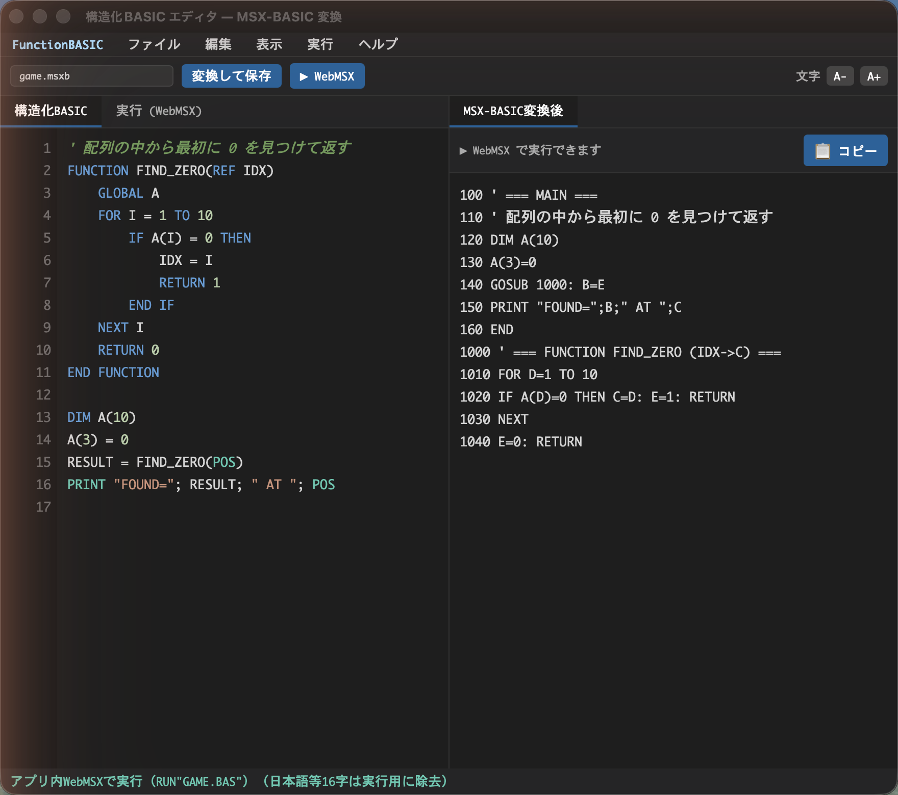
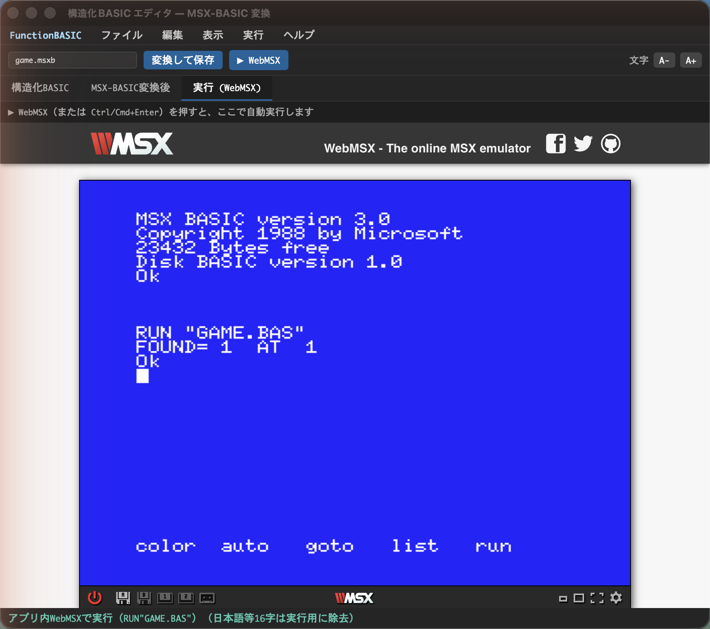

  

# FunctionBASIC

### Structured BASIC → MSX-BASIC → webMSX

Write modern, block-structured BASIC, transpile it to authentic MSX-BASIC, and run it instantly in webMSX — all inside one editor.

> ⚠️ **This is an experimental, work-in-progress tool.** The language, the transpiler, and the editor are all evolving. Expect rough edges, breaking changes, and missing features. Feedback and contributions are very welcome.

---

## Overview

**FunctionBASIC** is a small editor and transpiler that lets you write **Structured BASIC** — a modern dialect with real functions, block structures, local variables, and reference parameters — and converts it into **classic MSX-BASIC** (line numbers, `GOSUB`/`GOTO`, two-letter variables). You can then run the result instantly in **webMSX** without leaving the editor.

**What is Structured BASIC?** It is BASIC the way you would write it today: named `FUNCTION`s instead of `GOSUB` line jumps, `IF / ELSE / END IF` and `FOR / NEXT` blocks you can freely nest, locals by default, `GLOBAL` to opt in to shared state, and `REF` parameters for true pass-by-reference. No line numbers, no manual variable juggling.

**Why convert to MSX-BASIC?** Real MSX machines (and emulators) run tokenized MSX-BASIC. By transpiling, you keep the comfort of structured code while producing programs that run on actual 8-bit hardware and emulators — line-numbered, two-letter-variable, `GOSUB`-based BASIC that an MSX understands natively.

**Why webMSX?** webMSX is an excellent browser MSX emulator. FunctionBASIC embeds it (via an iframe, as an external service) and feeds your converted program straight in, so the loop of *write → convert → run* takes a single click. No floppy juggling, no manual `RUN`.

**Why it pairs well with AI (Claude).** Structured BASIC reads like ordinary structured code, which is exactly what large language models such as Claude generate well — far more reliably than hand-numbered spaghetti BASIC. You can ask an AI for a function, paste it in, convert, and run. This project itself was built iteratively with Claude.

---

## Features

- **Structured BASIC language** — `FUNCTION`, freely nestable `IF/FOR/WHILE` blocks, local-by-default variables, `GLOBAL`, `REF` parameters, `BREAK`/`CONTINUE`, `RETURN`, and arrays (including arrays by reference).
- **Automatic transpilation** to MSX-BASIC — line numbering, two-letter variable allocation, function-to-`GOSUB` expansion, return-value handling, and 255-byte line auto-splitting.
- **Long, readable variable names (name-length extension)** — MSX-BASIC only distinguishes the first two characters of a name, so it normally forces cryptic identifiers. FunctionBASIC removes that limit: write descriptive names like `PLAYER_SCORE` or `ENEMY_X`, and the transpiler assigns each one a unique MSX-legal name automatically.
- **Instant execution** — one click runs the converted program inside an embedded webMSX, loading and `RUN`-ning automatically.
- **All in one editor** — syntax highlighting, live conversion preview, error markers, formatting, JetBrains-style navigation, draggable split tabs, an in-app menu bar, a native OS menu, and Japanese / English UI.
- **Multi-file projects (`INCLUDE`)** — a preprocessor expands `INCLUDE`d files into a single program, with duplicate-include de-duplication and circular-include detection.
- **255-byte line auto-splitting** — generated lines that exceed MSX's 255-byte limit are automatically repacked across `:`/`;` boundaries (unsplittable lines, e.g. some `IF…THEN`, are flagged instead of silently truncated).
- **Real disk export** — generate a 720&nbsp;KB FAT12 `.dsk` image for openMSX, real hardware, or distribution.
- **Reverse transpilation** — turn existing MSX-BASIC back into Structured BASIC (and restore the original file split where possible).
- **Target machines** — built-ins are aware of MSX1 / MSX2 / MSX2+ / turboR (turboR by default), and the built-in table is editable.
- **Correct MSX text encoding** — files are saved as Shift-JIS (the encoding real MSX machines use); characters that cannot be represented are reported rather than silently corrupted.
- **Safe diagnostics** — the transpiler never silently mis-converts. Unsupported constructs and errors are reported with error codes and line/column positions, and shown as inline markers in the editor gutter.
- **Recursion guard** — this `GOSUB`-based scheme reuses fixed variable names, so recursive / cyclic calls cannot work; they are detected and reported (`E_RECURSION_UNSUPPORTED`) instead of producing broken code.

---

## Usage

1. **Write Structured BASIC** in the editor (functions, blocks, locals — no line numbers).
2. **Convert** — the "MSX-BASIC (output)" tab shows the generated line-numbered BASIC live as you type; "Convert & Save" writes it to disk as Shift-JIS.
3. **Run** — press **▶ WebMSX** (or Ctrl/Cmd+Enter). The program is packaged and loaded into the embedded webMSX, which boots and runs it automatically. For real hardware or openMSX, use **Save Disk (.dsk)** instead.

---

## Building from source

**Prerequisites:** [Node.js](https://nodejs.org/) ≥ 22.6 (for the zero-dependency core and the browser editor). For the desktop app you also need the [Rust toolchain](https://www.rust-lang.org/tools/install) and the [Tauri prerequisites](https://v2.tauri.app/start/prerequisites/) for your OS (on macOS, the Xcode Command Line Tools).

The core has **no npm dependencies**, so there is nothing to `npm install`.

- **Run the core tests:** `npm test` — type-stripped TypeScript tests via Node's built-in test runner.
- **Browser editor (no build tools):** `npm run serve`, then open `http://localhost:8123`. This type-strips the core into `editor/core/` and serves the editor.
- **Desktop app (development):** `npm run app:dev` — builds the core and launches the Tauri dev window (Rust + system WebView).
- **Desktop app (release build):** `npm run app:build` — produces a bundled application under `src-tauri/target/release/bundle/` for your platform.

The desktop scripts use `npx @tauri-apps/cli`, so the Tauri CLI is fetched on demand (still no committed dependencies).

---

## Syntax Guide

| Construct | Form | Notes |
| --- | --- | --- |
| `FUNCTION` | `FUNCTION NAME(params) … END FUNCTION` | Top-level only. Use `REF` before a parameter for pass-by-reference. |
| `IF / ELSE` | `IF cond THEN … ELSE … END IF` | Block form; freely nestable inside loops and other blocks. |
| `FOR / NEXT` | `FOR I = a TO b [STEP s] … NEXT I` | Standard counted loop. |
| `WHILE` | `WHILE cond … WEND` | Condition loop; `BREAK` / `CONTINUE` supported. |
| `GLOBAL` | `GLOBAL X` | Opt in to a shared (global) variable; otherwise variables are local. |
| `RETURN` | `RETURN [value]` | Returns from a function, optionally with a value. |
| Arrays | `DIM A(n)` ; pass with `REF A` | Arrays may be passed by reference, including string arrays. |

---

## Transpiler Rules

- **Line numbering** — `MAIN` (your top-level code) starts at 100; each function gets its own 1000-step segment (1000, 2000, …). Comments mark each segment.
- **Variable names (length extension)** — MSX-BASIC treats only the first two characters of a name as significant (`COUNT` and `COUNTER` collide) and rejects `_`, which normally forces 1–2 letter names. FunctionBASIC lets you use long, descriptive identifiers and a name allocator maps each variable to a unique, first-two-characters-distinct MSX name. Pools are per type — `%` integer, `!` single, `#` double, `$` string, roughly 960 names each, with reserved words (`IF`, `TO`, `ON`, `OR`, `FN`, …) excluded — and locals whose lifetimes do not overlap reuse names across functions. `_` never appears in output names; if a type's pool is exhausted, conversion reports `E_VAR_NAMES_EXHAUSTED`.
- **Function expansion** — every `FUNCTION` becomes a `GOSUB` block; calls become `GOSUB <line>` and the call site reads the result variable afterward.
- **Return values** — a function's return value is assigned to a dedicated internal variable, which the caller copies immediately after the `GOSUB`.
- **Internal variable naming** — locals, loop counters, and return variables are allocated from a fixed two-letter pool so they never collide; recursion is rejected (call cycles are detected) because fixed names cannot re-enter.
- **Arrays by reference** — passing the same array always reuses one block (zero copy); calling a function with *different* arrays duplicates the block per array (monomorphization), so there is no per-call array copy.

---

## Examples

**1. A simple function** — find the first zero in an array.

Structured BASIC:
' find the first zero in an array  
FUNCTION FIND_ZERO(REF IDX)  
&nbsp;&nbsp;&nbsp;&nbsp;GLOBAL A  
&nbsp;&nbsp;&nbsp;&nbsp;FOR I = 1 TO 10  
&nbsp;&nbsp;&nbsp;&nbsp;&nbsp;&nbsp;&nbsp;&nbsp;IF A(I) = 0 THEN  
&nbsp;&nbsp;&nbsp;&nbsp;&nbsp;&nbsp;&nbsp;&nbsp;&nbsp;&nbsp;&nbsp;&nbsp;IDX = I  
&nbsp;&nbsp;&nbsp;&nbsp;&nbsp;&nbsp;&nbsp;&nbsp;&nbsp;&nbsp;&nbsp;&nbsp;RETURN 1  
&nbsp;&nbsp;&nbsp;&nbsp;&nbsp;&nbsp;&nbsp;&nbsp;END IF  
&nbsp;&nbsp;&nbsp;&nbsp;NEXT I  
&nbsp;&nbsp;&nbsp;&nbsp;RETURN 0  
END FUNCTION  
&nbsp;  
DIM A(10)  
A(3) = 0  
RESULT = FIND_ZERO(POS)  
PRINT "FOUND="; RESULT; " AT "; POS

Generated MSX-BASIC:
100 ' === MAIN ===  
110 ' find the first zero in an array  
120 DIM A(10)  
130 A(3)=0  
140 GOSUB 1000: B=E  
150 PRINT "FOUND=";B;" AT ";C  
160 END  
1000 ' === FUNCTION FIND_ZERO (IDX-&gt;C) ===  
1010 FOR D=1 TO 10  
1020 IF A(D)=0 THEN C=D: E=1: RETURN  
1030 NEXT  
1040 E=0: RETURN

**2. Multicolour cat from two overlapping sprites (MSX2)** — MSX hardware sprites are a single colour each, so a classic trick is to stack two sprites at the same position to get more colours. A cat (a white face sprite over an orange body sprite) bounces around the screen on its own. Full, convert-tested source: [`examples/cat-sprite.msxb`](examples/cat-sprite.msxb).

The heart of it — one cat is two sprites drawn at the same spot, then moved:

' one cat = two sprites at the same spot, in two colours  
PUT SPRITE 0, (CATX, CATY), 15, 0&nbsp;&nbsp;' front: white face  
PUT SPRITE 1, (CATX, CATY), 9, 1&nbsp;&nbsp;' behind: orange body

…which the transpiler turns into authentic MSX-BASIC (variables allocated, coordinates preserved):

300 PUT SPRITE 0,(A,B),15,0  
310 PUT SPRITE 1,(A,B),9,1

**3. Game skeleton** — a minimal main loop (illustrative).

Structured BASIC:
FUNCTION UPDATE()  
&nbsp;&nbsp;&nbsp;&nbsp;GLOBAL SCORE  
&nbsp;&nbsp;&nbsp;&nbsp;SCORE = SCORE + 1  
&nbsp;&nbsp;&nbsp;&nbsp;LOCATE 0, 0 : PRINT "SCORE"; SCORE  
END FUNCTION  
&nbsp;  
SCREEN 1  
SCORE = 0  
WHILE 1  
&nbsp;&nbsp;&nbsp;&nbsp;UPDATE()  
&nbsp;&nbsp;&nbsp;&nbsp;IF STRIG(0) THEN BREAK  
WEND  
PRINT "GAME OVER"

**4. MSX2 graphics + BGM/SE** — a `SCREEN 5` demo that sets a custom palette with `COLOR=(n,r,g,b)`, draws with `LINE …,BF` / `CIRCLE` / `PAINT` / `POINT`, double-buffers with `SET PAGE`, block-transfers VRAM with `COPY … TO …`, plays background music with `PLAY`, and fires a sound effect with `SOUND`. All of these MSX2-specific forms (the `=` palette syntax, the `TO` clause, the `B`/`BF` line options, and `POINT` / `PLAY` used as functions) are preserved verbatim through transpilation while your variables are still renamed. Full, convert-tested source: [`examples/msx2-graphics-sound.msxb`](examples/msx2-graphics-sound.msxb).

---

## Roadmap

FunctionBASIC is early and developing. Planned directions (no fixed dates):

- **Windows support** — the desktop app is built with Tauri to target both Windows and macOS; package, sign, and test the Windows build (development so far has been on macOS).
- **Native MSX playback** — run on a native emulator in addition to the embedded webMSX: launch openMSX with the generated `.dsk` auto-mounted and `RUN` it via a Tcl script (Windows / macOS), and integrate a native Windows MSX player.
- **Settings screen** — an in-app settings UI to edit the webMSX URL, the built-in command/function table (with reset to defaults), the target machine, and native-player / emulator paths.
- **Language growth** — richer Structured BASIC: `SELECT/CASE`, more string helpers, constants, local arrays, and ergonomic improvements.
- **Built-in coverage by generation** — completing the MSX/MSX2/MSX2+/turboR command set. Done so far: text/printing/file I/O (`PRINT USING`, `LPRINT`, `LINE INPUT`, `OPEN/CLOSE/FIELD … AS`, `GET/PUT #`, `KILL`, `NAME … AS`), type conversion (`CINT`/`CSNG`/`CDBL`, `CVI`/`MKI$` …), file/format functions (`EOF`, `LOC`, `LOF`, `DSKF`, `TAB`, `SPC`, `USR`), and the `CALL <name>` / `_<name>` extended-statement mechanism that reaches MSX-MUSIC (FM) and MSX-AUDIO (extension names pass through verbatim; needs the matching sound hardware to play). MSX2+ modes (`SCREEN 10`–`12`, `SET SCROLL`) and turbo R (`_TURBO ON`/`OFF` CPU switch, `CALL PCMPLAY`/`PCMREC`/`PAUSE`) transpile too. See [`examples/msx2-text-format.msxb`](examples/msx2-text-format.msxb), [`examples/msx-music-fm.msxb`](examples/msx-music-fm.msxb), and [`examples/turbo-r.msxb`](examples/turbo-r.msxb). Next: event traps (`SPRITE`/`KEY`/`INTERVAL`, `ON … GOSUB`).
- **MSX2 graphics** — first-class helpers for MSX2 screen modes, palettes, and sprites. (The built-in table already covers the MSX2 audio/visual command set — `COPY`, `POINT`, `SET PAGE`/`SET SCROLL`/`SET ADJUST`, the `COLOR=(…)` palette syntax, `LINE …,B`/`BF`, `COLOR SPRITE`, `PUT KANJI`, and the `SET TIME`/`SET DATE` / `TIME` system clock — so it transpiles correctly today; higher-level helpers are next.) See the convert-tested coverage program [`examples/msx2-coverage.msxb`](examples/msx2-coverage.msxb).
- **Sound** — BGM and SE helpers (PSG, and where available FM/SCC). (`PLAY` as both statement and function, and `SOUND`, already transpile correctly.)
- **Event traps** — `SPRITE ON`/`OFF`, `INTERVAL`, `ON SPRITE GOSUB`, `ON KEY GOSUB` etc. need a structured mapping (no line numbers in the source), so they are deliberately deferred to their own design pass.
- **AI integration** — tighter "describe it, generate it, convert it, run it" flow with Claude.
- **Editor** — code folding and large-file performance (likely a CodeMirror-based editor), beyond today's lightweight zero-dependency editor.
- **Tooling** — expanding CI (GitHub Actions already runs the core tests) to full desktop (Tauri) builds, signed / notarized desktop binaries, and release packaging.

Tracked work and ideas live in the issue tracker. Suggestions are welcome.

---

## Contributing

Contributions are welcome.

- **Issues** — bug reports, feature requests, and design discussion. Please include steps to reproduce and your platform.
- **Pull requests** — small, focused PRs are easiest to review. Run the existing tests before submitting, and describe what changed and why.

---

## License

Released under the **MIT License**.

MIT © 2026 suzuki-black

You may use, copy, modify, and distribute this software freely, including for commercial purposes, provided the copyright notice and permission notice are kept. The software is provided "as is", without warranty of any kind. See the `LICENSE` file for the full text.

---

## Trademark & External Service Notice

- **MSX** is a trademark of its respective rights holder. This project is **unofficial** and is not affiliated with, endorsed by, or sponsored by the MSX trademark holder.
- **webMSX** is an **external service / third-party emulator**. FunctionBASIC merely links to and embeds it via an iframe; it does not bundle or redistribute webMSX, and it is **not an official webMSX product**.
- We use these technologies with **gratitude and respect** for the MSX trademark holder and for the author of webMSX, whose work makes projects like this possible.

---
---

# FunctionBASIC（日本語）

### 構造化BASIC → MSX-BASIC → webMSX

モダンなブロック構造の構造化BASICを書き、本物のMSX-BASICへ変換し、そのまま webMSX で即実行 — すべて1つのエディタの中で。

> ⚠️ **これは実験的かつ発展途上のツールです。** 言語・変換器・エディタはいずれも進化の途中で、粗削りな部分・破壊的変更・未実装機能があります。フィードバックと貢献を歓迎します。

---

## 概要

**FunctionBASIC** は、**構造化BASIC**（本物の関数・ブロック構造・ローカル変数・参照引数を備えたモダンな方言）を書き、それを**昔ながらのMSX-BASIC**（行番号・`GOSUB`/`GOTO`・2文字変数）へ変換する小さなエディタ兼トランスパイラです。変換結果はエディタから離れることなく **webMSX** で即実行できます。

**構造化BASICとは？** いまの感覚で書けるBASICです。`GOSUB` の行ジャンプではなく名前付き `FUNCTION`、自由に入れ子にできる `IF / ELSE / END IF` や `FOR / NEXT`、既定でローカルな変数、共有したいときだけ使う `GLOBAL`、そして真の参照渡しを行う `REF` 引数。行番号も手作業の変数管理も不要です。

**なぜMSX-BASICへ変換するのか？** 実機のMSX（やエミュレータ）はトークン化されたMSX-BASICで動きます。変換することで、構造化された書き味のまま、8bit実機やエミュレータで動く——行番号・2文字変数・`GOSUB`ベースの——MSXが直接理解できるプログラムを得られます。

**なぜwebMSXか？** webMSX は優れたブラウザ向けMSXエミュレータです。FunctionBASIC は（外部サービスとして iframe 経由で）これを埋め込み、変換結果を直接流し込むので、*書く→変換→実行* のループがワンクリックになります。ディスクの差し替えも手動 `RUN` も不要です。

**AI（Claude）との相性。** 構造化BASICは普通の構造化コードのように読めます。これはまさに Claude のような大規模言語モデルが得意とする形で、手作業で行番号を振ったスパゲッティBASICより遥かに安定して生成できます。関数をAIに頼んで貼り付け、変換して実行——本プロジェクト自体も Claude と反復的に作られました。

---

## 特徴

- **構造化BASIC言語** — `FUNCTION`、自由に入れ子可能な `IF/FOR/WHILE`、既定ローカル変数、`GLOBAL`、`REF` 参照引数、`BREAK`/`CONTINUE`、`RETURN`、配列（配列の参照渡しを含む）。
- **自動変換** — 行番号付与、2文字変数の割り当て、関数の `GOSUB` 展開、戻り値の処理、255バイト行の自動分割。
- **長く読みやすい変数名（名前長の拡張）** — MSX-BASICは名前の先頭2文字しか区別しないため、本来は暗号的な名前を強いられます。FunctionBASICはこの制限を撤廃：`PLAYER_SCORE` や `ENEMY_X` のような説明的な名前を書け、変換器が各変数へ一意なMSX有効名を自動割り当てします。
- **即時実行** — 埋め込み webMSX に変換結果を流し込み、自動でロード＆`RUN`。ワンクリック。
- **エディタ内で完結** — シンタックスハイライト、ライブ変換プレビュー、エラー表示、整形、JetBrains風ナビゲーション、ドラッグ可能な分割タブ、アプリ内メニューバー、OSネイティブメニュー、日本語/英語UI。
- **複数ファイル（`INCLUDE`）** — プリプロセッサが `INCLUDE` を展開して1つのプログラムへ統合。二重 include の重複排除、循環 include の検出付き。
- **255バイト行の自動分割** — MSXの255バイト制限を超える生成行を `:`/`;` 境界で自動的に再パック（分割できない行＝一部の `IF…THEN` 等は黙って切り捨てず警告）。
- **実ディスク書き出し** — openMSX・実機・配布用に 720&nbsp;KB FAT12 の `.dsk` を生成。
- **逆変換** — 既存のMSX-BASICを構造化BASICへ戻す（可能な範囲で元のファイル分割も復元）。
- **対象機種** — 組み込み関数は MSX1 / MSX2 / MSX2+ / turboR を考慮（既定 turboR）。組み込み表は編集可能。
- **正しいMSX文字コード** — ファイルは実機MSXが使う **Shift-JIS** で保存。表現できない文字は黙って壊さず報告します。
- **安全な診断** — 変換器は黙って誤変換しません。未対応構文やエラーは**エラーコード＋行・列位置**付きで報告し、エディタのガターに印として表示します。
- **再帰ガード** — この `GOSUB` 方式は固定の変数名を使い回すため再帰／循環呼び出しは成立しません。壊れたコードを出す代わりに検出して報告（`E_RECURSION_UNSUPPORTED`）します。

---

## 使い方

1. **構造化BASICを書く**（関数・ブロック・ローカル変数。行番号は不要）。
2. **変換** — 「MSX-BASIC変換後」タブに、入力に追従して行番号付きBASICがライブ表示されます。「変換して保存」で Shift-JIS として書き出します。
3. **実行** — **▶ WebMSX**（または Ctrl/Cmd+Enter）。プログラムが梱包されて埋め込み webMSX に読み込まれ、自動で起動・実行します。実機や openMSX 向けには **ディスク(.dsk)を保存** を使います。

---

## ソースからのビルド

**前提:** [Node.js](https://nodejs.org/) 22.6 以上（依存ゼロのコア＆ブラウザ版エディタ用）。デスクトップ版にはさらに [Rust ツールチェイン](https://www.rust-lang.org/tools/install) と、OSごとの [Tauri 前提条件](https://v2.tauri.app/start/prerequisites/)（macOS なら Xcode Command Line Tools）が必要です。

コアは **npm依存ゼロ**なので `npm install` は不要です。

- **コアのテスト:** `npm test` — Node 標準テストランナーで型ストリップした TypeScript を実行。
- **ブラウザ版エディタ（ビルドツール不要）:** `npm run serve` 後、`http://localhost:8123` を開く。コアを `editor/core/` へ型ストリップしてエディタを配信します。
- **デスクトップ版（開発）:** `npm run app:dev` — コアをビルドし Tauri 開発ウィンドウ（Rust＋システムWebView）を起動。
- **デスクトップ版（リリースビルド）:** `npm run app:build` — `src-tauri/target/release/bundle/` にOS向けのアプリを生成。

デスクトップ用スクリプトは `npx @tauri-apps/cli` を使うため、Tauri CLI は必要時に取得されます（コミット対象の依存は増えません）。

---

## 文法ガイド

| 構文 | 形 | 補足 |
| --- | --- | --- |
| `FUNCTION` | `FUNCTION 名前(引数) … END FUNCTION` | トップレベルのみ。参照渡しは引数の前に `REF`。 |
| `IF / ELSE` | `IF 条件 THEN … ELSE … END IF` | ブロック形式。ループ等の中に自由に入れ子可。 |
| `FOR / NEXT` | `FOR I = a TO b [STEP s] … NEXT I` | 標準の数え上げループ。 |
| `WHILE` | `WHILE 条件 … WEND` | 条件ループ。`BREAK` / `CONTINUE` 対応。 |
| `GLOBAL` | `GLOBAL X` | 共有（グローバル）変数を使う宣言。なければローカル。 |
| `RETURN` | `RETURN [値]` | 関数から戻る。値を返せる。 |
| 配列 | `DIM A(n)` ／ `REF A` で渡す | 配列は参照渡し可。文字列配列も可。 |

---

## 変換ルール

- **行番号の付与** — `MAIN`（トップレベルのコード）は 100 から。各関数は 1000 刻みの専用セグメント（1000, 2000, …）。各セグメントはコメントで明示。
- **変数名の変換（長さ拡張）** — MSXは名前の**先頭2文字しか区別せず**（`COUNT` と `COUNTER` は衝突）、`_` も使えないため、本来は1〜2文字の名前を強いられます。FunctionBASICでは長い説明的な名前を書け、名前アロケータが各変数へ**先頭2文字で一意なMSX名**を割り当てます。プールは型別（`%`整数 `!`単精度 `#`倍精度 `$`文字列で各約960個、`IF`/`TO`/`ON`/`OR`/`FN` 等の予約語は除外）で、生存区間が重ならないローカルは関数をまたいで名前を再利用します。出力名に `_` は出ません。型のプールを使い切った場合は `E_VAR_NAMES_EXHAUSTED` を報告します。
- **関数の展開（GOSUB化）** — すべての `FUNCTION` は `GOSUB` ブロックに。呼び出しは `GOSUB <行>` になり、直後に結果変数を読み取ります。
- **戻り値の扱い** — 戻り値は専用の内部変数へ代入し、呼び出し側が `GOSUB` 直後にコピーします。
- **内部変数の命名規則** — ローカル・ループ変数・戻り値変数は固定の2文字プールから割り当て、衝突しません。固定名は再入できないため再帰は禁止（呼び出し循環を検出してエラー）。
- **配列の参照渡し** — 常に同じ配列ならブロック1個を共有（ゼロコピー）。異なる配列で呼ぶと配列ごとにブロックを複製（モノモーフィック化）し、呼び出しごとの配列コピーは発生しません。

---

## サンプル

**1. 簡単な関数** — 配列の中から最初の 0 を見つける。

構造化BASIC:
' 配列の中から最初に 0 を見つけて返す  
FUNCTION FIND_ZERO(REF IDX)  
&nbsp;&nbsp;&nbsp;&nbsp;GLOBAL A  
&nbsp;&nbsp;&nbsp;&nbsp;FOR I = 1 TO 10  
&nbsp;&nbsp;&nbsp;&nbsp;&nbsp;&nbsp;&nbsp;&nbsp;IF A(I) = 0 THEN  
&nbsp;&nbsp;&nbsp;&nbsp;&nbsp;&nbsp;&nbsp;&nbsp;&nbsp;&nbsp;&nbsp;&nbsp;IDX = I  
&nbsp;&nbsp;&nbsp;&nbsp;&nbsp;&nbsp;&nbsp;&nbsp;&nbsp;&nbsp;&nbsp;&nbsp;RETURN 1  
&nbsp;&nbsp;&nbsp;&nbsp;&nbsp;&nbsp;&nbsp;&nbsp;END IF  
&nbsp;&nbsp;&nbsp;&nbsp;NEXT I  
&nbsp;&nbsp;&nbsp;&nbsp;RETURN 0  
END FUNCTION  
&nbsp;  
DIM A(10)  
A(3) = 0  
RESULT = FIND_ZERO(POS)  
PRINT "FOUND="; RESULT; " AT "; POS

変換後 MSX-BASIC:
100 ' === MAIN ===  
110 ' 配列の中から最初に 0 を見つけて返す  
120 DIM A(10)  
130 A(3)=0  
140 GOSUB 1000: B=E  
150 PRINT "FOUND=";B;" AT ";C  
160 END  
1000 ' === FUNCTION FIND_ZERO (IDX-&gt;C) ===  
1010 FOR D=1 TO 10  
1020 IF A(D)=0 THEN C=D: E=1: RETURN  
1030 NEXT  
1040 E=0: RETURN

**2. 2枚重ねスプライトの多色猫（MSX2）** — MSXのハードウェアスプライトは1枚＝1色なので、同じ位置に2枚重ねて多色にするのが定番技です。白い顔スプライトをオレンジの体スプライトに重ねた猫が、画面内を自分で跳ね回ります。変換確認済みの全ソース：[`examples/cat-sprite.msxb`](examples/cat-sprite.msxb)。

肝は「1匹の猫＝同じ位置に2枚のスプライト」を描いて動かすこと：

' 1匹の猫＝同じ位置に2枚のスプライト（2色）  
PUT SPRITE 0, (CATX, CATY), 15, 0&nbsp;&nbsp;' 前面：白い顔  
PUT SPRITE 1, (CATX, CATY), 9, 1&nbsp;&nbsp;' 背面：オレンジの体

…これを変換器が本物のMSX-BASICにします（変数割当・座標は保持）：

300 PUT SPRITE 0,(A,B),15,0  
310 PUT SPRITE 1,(A,B),9,1

**3. ゲームの雛形** — 最小のメインループ（説明用）。

構造化BASIC:
FUNCTION UPDATE()  
&nbsp;&nbsp;&nbsp;&nbsp;GLOBAL SCORE  
&nbsp;&nbsp;&nbsp;&nbsp;SCORE = SCORE + 1  
&nbsp;&nbsp;&nbsp;&nbsp;LOCATE 0, 0 : PRINT "SCORE"; SCORE  
END FUNCTION  
&nbsp;  
SCREEN 1  
SCORE = 0  
WHILE 1  
&nbsp;&nbsp;&nbsp;&nbsp;UPDATE()  
&nbsp;&nbsp;&nbsp;&nbsp;IF STRIG(0) THEN BREAK  
WEND  
PRINT "GAME OVER"

**4. MSX2グラフィック＋BGM/SE** — `SCREEN 5` のデモ。`COLOR=(n,r,g,b)` で独自パレットを設定し、`LINE …,BF` / `CIRCLE` / `PAINT` / `POINT` で描画、`SET PAGE` でダブルバッファ、`COPY … TO …` でVRAMブロック転送、`PLAY` でBGM、`SOUND` でSEを鳴らします。これらMSX2固有の書式（パレットの `=` 構文、`TO` 節、`B`/`BF` のラインオプション、関数として使う `POINT` / `PLAY`）は変換後もそのまま保たれ、ユーザ変数だけが2文字名へ割り当てられます。変換確認済みの全ソース：[`examples/msx2-graphics-sound.msxb`](examples/msx2-graphics-sound.msxb)。

---

## ロードマップ

FunctionBASIC はまだ初期段階で、発展途上です。予定している方向性（時期は未定）：

- **Windows対応** — デスクトップ版は Tauri で Windows / macOS 両対応を想定。Windowsビルドのパッケージング・署名・動作確認（これまでの開発は macOS 中心）。
- **ネイティブMSXプレイヤー対応** — 埋め込み webMSX に加え、ネイティブエミュレータでの実行：生成した `.dsk` を openMSX に自動マウントし Tcl スクリプトで `RUN`（Windows / macOS）、および Windows のネイティブMSXプレイヤー連携。
- **設定画面** — アプリ内設定UIで、webMSX URL、組み込み命令・関数表（既定へのリセット付き）、対象機種、ネイティブプレイヤー／エミュレータのパスを編集。
- **言語の拡張** — より豊かな構造化BASIC：`SELECT/CASE`、文字列ヘルパの充実、定数、ローカル配列、使い勝手の改善。
- **世代別の組み込み命令網羅** — MSX/MSX2/MSX2+/turboR の命令一式を順次対応。対応済：テキスト/印字/ファイル入出力（`PRINT USING`・`LPRINT`・`LINE INPUT`・`OPEN/CLOSE/FIELD … AS`・`GET/PUT #`・`KILL`・`NAME … AS`）、型変換（`CINT`/`CSNG`/`CDBL`、`CVI`/`MKI$` 等）、ファイル/書式関数（`EOF`・`LOC`・`LOF`・`DSKF`・`TAB`・`SPC`・`USR`）、`CALL <名>`/`_<名>` 拡張ステートメント機構（MSX-MUSIC（FM）・MSX-AUDIO へ到達。拡張命令名は素通し。実際に鳴らすには対応サウンド機が必要）。MSX2+（`SCREEN 10`–`12`・`SET SCROLL`）と turbo R（`_TURBO ON`/`OFF` の CPU 切替・`CALL PCMPLAY`/`PCMREC`/`PAUSE`）も変換可。例：[`examples/msx2-text-format.msxb`](examples/msx2-text-format.msxb)・[`examples/msx-music-fm.msxb`](examples/msx-music-fm.msxb)・[`examples/turbo-r.msxb`](examples/turbo-r.msxb)。次はイベントトラップ（`SPRITE`/`KEY`/`INTERVAL`・`ON … GOSUB`）。
- **MSX2グラフィック対応** — MSX2のスクリーンモード・パレット・スプライトの一級サポート。（組み込み表は MSX2 の音・映像命令一式 ― `COPY`・`POINT`・`SET PAGE`/`SET SCROLL`/`SET ADJUST`・`COLOR=(…)` パレット構文・`LINE …,B`/`BF`・`COLOR SPRITE`・`PUT KANJI`・`SET TIME`/`SET DATE`/`TIME` システム時計 ― を網羅済みで、現状でも正しく変換されます。次はより高レベルなヘルパ。）変換確認済みのカバレッジ例：[`examples/msx2-coverage.msxb`](examples/msx2-coverage.msxb)。
- **BGM/SE対応** — サウンドのヘルパ（PSG、可能なら FM/SCC）。（文・関数の両形の `PLAY` と `SOUND` は既に正しく変換されます。）
- **イベントトラップ** — `SPRITE ON`/`OFF`、`INTERVAL`、`ON SPRITE GOSUB`、`ON KEY GOSUB` 等は構造化（ソースに行番号が無い）への対応付けが要設計のため、専用の設計回として後回し。
- **AI生成との統合** — Claude との「説明する→生成する→変換する→実行する」流れをより緊密に。
- **エディタ** — コードの折りたたみと大規模ファイル性能（CodeMirrorベースのエディタを想定）。現状の軽量・依存ゼロエディタを発展。
- **ツール整備** — CI（GitHub Actions、コアのテストは導入済み）をデスクトップ(Tauri)フルビルドへ拡張、署名・公証済みバイナリ、リリースパッケージング。

作業項目やアイデアは Issue で管理しています。提案を歓迎します。

---

## 貢献方法

貢献を歓迎します。

- **Issue** — バグ報告・機能要望・設計の議論。再現手順と利用環境を添えてください。
- **Pull Request** — 小さく焦点の絞れたPRがレビューしやすいです。既存テストを実行し、変更内容と理由を記載してください。

---

## ライセンス

**MITライセンス**で公開しています。

MIT © 2026 suzuki-black

著作権表示と許諾表示を保持すれば、商用を含め自由に使用・複製・改変・配布できます。本ソフトウェアは「現状有姿」で提供され、いかなる保証もありません。全文は `LICENSE` ファイルを参照してください。

---

## 商標・外部サービスに関する注意

- **MSX** は各権利者の商標です。本プロジェクトは**非公式**であり、MSX商標権者と提携・承認・後援の関係はありません。
- **webMSX** は**外部サービス／サードパーティのエミュレータ**です。FunctionBASIC は iframe 経由でリンク・埋め込みをしているだけで、webMSX を同梱・再配布しておらず、**公式の webMSX 製品ではありません**。
- これらの技術を、MSX商標権者および webMSX 作者への**感謝と敬意**をもって利用しています。彼らの仕事が、このようなプロジェクトを可能にしています。
