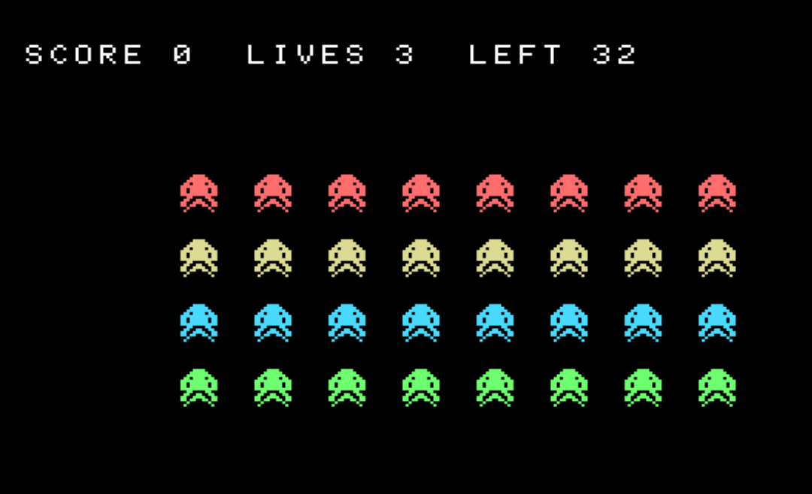
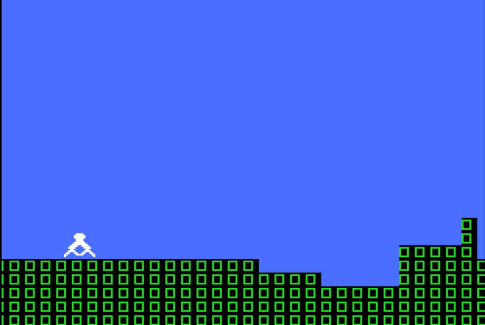

<p align="center">
  
</p>

# FunctionBASIC

### Structured BASIC → MSX-BASIC → webMSX

Write modern, block-structured BASIC, transpile it to authentic MSX-BASIC, and run it instantly in webMSX — all inside one editor.

**[日本語](#functionbasic日本語)** · **[⬇ Download the desktop app](https://github.com/suzuki-black/FunctionBASIC/releases/latest)**

[](#license)
[](#contributing)
[](#roadmap)
[](https://github.com/suzuki-black/FunctionBASIC/actions)
[](#what-it-is)

> ⚠️ **This is an experimental, work-in-progress tool.** The language, the transpiler, and the editor are all evolving. Expect rough edges, breaking changes, and missing features. Feedback and contributions are very welcome.




*A complete, playable arcade shooter — hardware sprites, per-row colours, animation, sound, and a fleet redraw hand-optimized in inline Z80 — written **entirely in Structured BASIC**. See the [Space Shooter showcase](#featured-example--space-shooter-turbo-r).*

---

## What it is

**FunctionBASIC** is a small editor and transpiler for **Structured BASIC** — a modern dialect with real functions, block structures, local variables, and reference parameters. It converts your code to **classic MSX-BASIC** (line numbers, `GOSUB`/`GOTO`, two-letter variables) that runs on real 8-bit hardware and emulators, then runs the result instantly in embedded **webMSX** — so the *write → convert → run* loop is a single click.

**Structured BASIC** is BASIC the way you would write it today: named `FUNCTION`s instead of `GOSUB` line jumps, freely nestable `IF/ELSE/END IF` and `FOR/NEXT`, locals by default, `GLOBAL` to opt in to shared state, and `REF` parameters for true pass-by-reference. No line numbers, no manual variable juggling.

It also goes the other way: FunctionBASIC can *decompile* plain, line-numbered MSX-BASIC back into Structured BASIC with no map required (see [Reverse tools](#reverse-tools)). And because Structured BASIC reads like ordinary structured code, it pairs unusually well with AI assistants such as Claude (see [Vibe-coding](#vibe-coding-with-an-ai-assistant)) — this project itself was built iteratively with Claude.

---

## Quick start

1. **Write Structured BASIC** in the editor — functions, blocks, locals, no line numbers.
2. **Convert** — the *MSX-BASIC (output)* tab shows the generated line-numbered BASIC live as you type; **Convert & Save** writes it to disk as Shift-JIS.
3. **Run** — press **▶ WebMSX** (or Ctrl/Cmd+Enter). The program is packaged and loaded into the embedded webMSX, which boots and `RUN`s it automatically. For real hardware or openMSX, use **Save Disk (.dsk)** instead.

Prefer a prebuilt app? Grab it from **[Releases](https://github.com/suzuki-black/FunctionBASIC/releases/latest)** — see [Run & export](#run--export) and [Building from source](#building-from-source). Or run the browser editor with `npm run serve`.

---

## The language

### Structured control flow

- **`FUNCTION`** — named, top-level functions with their own locals; calls become `GOSUB` for you. `REF` before a parameter gives true pass-by-reference (including arrays and string arrays).
- **Nestable `IF/FOR/WHILE/DO`** — block forms you can freely nest, with `BREAK` / `CONTINUE` and `RETURN [value]`. `IF` supports **`ELSEIF`** for multi-way branches, and **`DO … LOOP`** adds pre-test / post-test / infinite loops alongside `WHILE`.
- **`MACRO`** — compile-time inline macros: `MACRO NAME(args) = expr` expands to the expression in place, so a small helper has **no `GOSUB` overhead** (unlike a `FUNCTION`).
- **Locals by default, `GLOBAL` to share** — variables are local unless declared `GLOBAL`, so functions don't clobber each other.
- **Long, readable names** — write `PLAYER_SCORE` / `ENEMY_X`; the transpiler maps each to a unique 2-character MSX name (MSX distinguishes only the first two characters).
- **`CONST`** — compile-time named constants, folded and inlined as literals (re-assignment is an error).
- **Recursion** — self- and mutually-recursive functions work, via automatic frame save/restore on a software stack (depth configurable; `REF` params in a recursive function are reported, not mis-compiled).
- **`STRICT`** — opt-in static typing (see [below](#strict-mode)).

| Construct | Form | Notes |
| --- | --- | --- |
| `FUNCTION` | `FUNCTION NAME(params) … END FUNCTION` | Top-level only. Use `REF` before a parameter for pass-by-reference. |
| `IF / ELSEIF / ELSE` | `IF cond THEN … ELSEIF cond THEN … ELSE … END IF` | Block form; `ELSEIF` for multi-way. Freely nestable. Single-line `IF … THEN stmt` is **not** supported (use the block form). |
| `FOR / NEXT` | `FOR I = a TO b [STEP s] … NEXT I` | Standard counted loop. |
| `WHILE` | `WHILE cond … WEND` | Pre-test loop; `BREAK` / `CONTINUE` supported. |
| `DO / LOOP` | `DO [WHILE\|UNTIL c] … LOOP [WHILE\|UNTIL c]` | Pre-test, post-test (runs ≥ 1) or infinite (`DO … LOOP`, exit with `BREAK`). |
| `MACRO` | `MACRO NAME(args) = expr` | Compile-time inline macro; expands to an expression (no call overhead). |
| `GLOBAL` | `GLOBAL X` | Opt in to a shared (global) variable; otherwise variables are local. |
| `CONST` | `CONST NAME[%!#$] = const-expr` | Compile-time constant; folded and inlined as a literal. Re-assignment is an error. An optional type suffix is validated (`CONST N% = 3`; `%` requires an integer value) and is **required under `STRICT`**. |
| `RETURN` | `RETURN [value]` | Returns from a function, optionally with a value. |
| `SELECT CASE` | `SELECT CASE x … CASE … CASE ELSE … END SELECT` | Multi-way branch (see below). |
| `STRUCT` | `STRUCT … END STRUCT` ; `DIM a(n) AS T` | Struct-of-arrays (see below). |
| `DATASET` | `DATASET name … END DATASET` | Named data block (see below). |
| `EVENT TIMER` | `EVENT TIMER n … END EVENT` | Periodic handler (see below). |
| `ASM` | `ASM` … `END ASM` | Inline Z80 assembly (see below). |
| Arrays | `DIM A(n)` ; pass with `REF A` | Arrays may be passed by reference, including string arrays. |

### Game-BASIC constructs

These are the newest headline features — higher-level constructs that lower to authentic MSX-BASIC at (mostly) zero runtime cost.

- **`SELECT CASE`** — the readable multi-way branch (Structured BASIC has no `ELSEIF`). Supports value / list (`CASE 6,7,8`), `TO` ranges (`CASE lo TO hi`), `IS` relational (`CASE IS < 0`), and `CASE ELSE`; strings work too. The selector is evaluated **once**, then lowered to a cached-selector `IF` chain.

  ```basic
  SELECT CASE STATE%
      CASE 6, 7, 8        ' list
          MOVE_LEFT()
      CASE 10 TO 20       ' range
          SPEED_UP()
      CASE IS < 0         ' relational
          RESET()
      CASE ELSE
          IDLE()
  END SELECT
  ```

- **`STRUCT`** — declare a record and `DIM` an array of it, then access fields with dot notation:

  ```basic
  STRUCT ENEMY
      HP%
      X%
      Y%
  END STRUCT
  DIM FOE(20) AS ENEMY
  FOE(3).HP% = 100
  ```

  It lowers to a **struct-of-arrays** (parallel per-field MSX arrays), so it costs exactly the same as hand-written parallel arrays — **zero runtime overhead**. `GLOBAL FOE` shares every field across functions. (v1: flat fields; no whole-record pass yet.) Identifiers are case-insensitive and the house style is **all-uppercase** with `_` separators (see the [style guide](docs/13-style-guide.md)).

- **`DATASET`** — named data blocks that replace the opaque global `READ`/`DATA`/`RESTORE` pointer:

  ```basic
  DATASET ALIEN_A
      DATA 8, 28, 62, 127
  END DATASET
  ' …
  READ ALIEN_A INTO A%, B%, C%, D%
  ```

  A block body holds only `DATA` lines (values may mix numbers and strings). v1 uses the memory-optimal **strategy A**: zero extra RAM, auto-`RESTORE` on block switch, so read each block to completion before moving to the next. `RESTORE name` rewinds a block.

- **`EVENT TIMER`** — a periodic handler that lowers to `ON INTERVAL=n GOSUB` + `INTERVAL ON`:

  ```basic
  EVENT TIMER 60          ' every 60 interrupts (~1s)
      TICK()
  END EVENT
  ```

  One timer only, top-level (MAIN) only; the handler shares MAIN's variables. It is a **cooperative** interrupt — it fires at BASIC statement boundaries, not preemptively. **`EVENT VBLANK` is intentionally not supported**: a true VBLANK hook can't safely re-enter the BASIC interpreter — use `HALT`-based frame sync (as the shooter does) or an ASM hook that sets a flag BASIC polls.

- **`MACRO`** — a compile-time inline helper. `MACRO NAME(args) = expr` expands to its expression at every call site, so it has **no `GOSUB` overhead** (unlike a `FUNCTION`). Arguments are parenthesized on expansion (no precedence surprises); self/mutual recursion, wrong arity and duplicate names are errors.

  ```basic
  MACRO SCREEN_COL(PX) = ((SCROLL% + (PX)) AND 255) \ 8
  ' … SCREEN_COL(PLAYER_X% + 8) expands inline, no call
  ```

### Inline Z80 assembly

`ASM … END ASM` blocks are assembled to machine code and wired in automatically. The code is placed in a buffer reserved just below `HIMEM` (read at run time, so it is machine-independent and not bound by the 255-byte string limit); `(NAME)` references a `%` integer BASIC variable via `VARPTR` operand patching (applied once); labels support relative jumps (`JR` / `DJNZ`) for loops and branches; and `DEFUSR`/`USR` runs it. This powers the arcade-smooth fleet redraw in the [Space Shooter](#featured-example--space-shooter-turbo-r). (`%` integer variables only; no absolute `CALL`/`JP` to labels yet.)

### Not available in Structured BASIC

Because Structured BASIC has **no line numbers** and **renames variables to two-letter names**, some classic MSX-BASIC constructs cannot work. The transpiler reports a clear error instead of silently mis-converting — use the structured equivalent:

| Not usable | Use instead |
| --- | --- |
| `GOTO` / `GOSUB <line>` (raw line jumps) | `FUNCTION`, `IF`/`FOR`/`WHILE`, `BREAK`/`CONTINUE` |
| `ON x GOTO/GOSUB <line numbers>` (`E_ON_LINE_TARGET`) | `ON x GOTO/GOSUB <FUNCTION names>` (handlers must be no-arg) |
| `ON ERROR GOTO <line>` | `ON ERROR GOTO <FUNCTION>`, or `ON ERROR GOTO 0` to disable |
| `RESUME <line>` (`E_RESUME_LINE`) | `RESUME` / `RESUME NEXT` / `RESUME 0` |
| `RESTORE <line>` (`E_RESTORE_LINE`) | bare `RESTORE` (reset to the first `DATA`), or `RESTORE name` for a `DATASET` |
| `DEFINT` / `DEFSNG` / `DEFDBL` / `DEFSTR` (`E_DEF_UNSUPPORTED`) | name suffixes: `%` int, `!` single, `#` double, `$` string (e.g. `COUNT%`, `LABEL$`) |
| `DEF FN` / `DEF USR` | a `FUNCTION` (and `POKE` the USR vector if you truly need machine code) |
| Direct/editor commands: `RUN` `LIST` `AUTO` `RENUM` `NEW` `CONT` `DELETE` `EDIT` | not program statements — they are interactive only |
| Single-line `IF … THEN <stmt>` (no `END IF`) | a block `IF … THEN` … `END IF` |

(`ON … GOSUB <fn>` handler functions and `ON x GOTO/GOSUB <fn>` targets must take **no parameters** — `E_HANDLER_PARAMS`.)

### Strict mode

Put `STRICT` at the top of a program to turn on **opt-in static type checking** (Rust-style: no implicit conversions). It is off by default — existing code is unaffected, and MSX's usual implicit numeric conversions still apply in non-strict code. Under `STRICT`:

- **Every variable, array, parameter, `FOR` variable and `CONST` must carry a type suffix** — `%` integer, `!` single, `#` double, `$` string. Untyped names are an error (`E_STRICT_UNTYPED`).
- **Assignments, function arguments and return values must match the type exactly.** No implicit conversion: `A% = B#`, `A% = 1.5`, and any string/number mix are errors (`E_TYPE_MISMATCH`). Convert explicitly with `CINT` / `CSNG` / `CDBL` / `INT` / `FIX` / `ASC` / `STR$` / `VAL` …
- Numeric literals are flexible (`5` fits `%`/`!`/`#`; `1.5` fits `!`/`#`); operators follow MSX promotion, and the exact-match check fires at the assignment/argument/return boundary.
- Because integer (`%`) math is the fast path on the Z80, STRICT also nudges game logic toward `%`. For trig/graphics, keep coordinates and math in one float type (`!`/`#`) — MSX graphics statements accept floats — or convert at the boundary.

```basic
STRICT
FUNCTION ADD%(A%, B%)
    RETURN A% + B%
END FUNCTION
TOTAL% = 0
FOR I% = 1 TO 10
    TOTAL% = ADD%(TOTAL%, I%)
NEXT I%
AVG! = CSNG(TOTAL%) / 10        ' explicit % -> ! conversion
```

See [`examples/strict-demo.msxb`](examples/strict-demo.msxb).

### OPTION EXPLICIT

Put `OPTION EXPLICIT` at the top to flag **reading a variable that is never assigned or declared** (`E_UNDECLARED_VAR`) — it catches the classic typo where a misspelled name (e.g. `RADUIS` for `RADIUS`) is silently read as `0`. Off by default. It is orthogonal to `STRICT`: `STRICT` is about *types*, `OPTION EXPLICIT` is about *undeclared reads*. "Declared" means assigned, or declared via `GLOBAL` / `DIM` / `CONST` / a parameter / a `FOR` variable / an `INPUT`/`READ` target (FunctionBASIC creates scalars on assignment). Scalars only — array/function typos are already caught by call resolution.

---

## Transpiler & output

**Automatic conversion.** The transpiler never silently mis-converts — it maps structured code to line-numbered MSX-BASIC deterministically:

- **Line numbering** — `MAIN` (your top-level code) starts at 100; each function gets its own 1000-step segment (1000, 2000, …), each marked with a comment.
- **Variable names (length extension)** — MSX-BASIC keeps only a name's first two characters (`COUNT` and `COUNTER` collide) and rejects `_`. FunctionBASIC lifts that: write long descriptive names and an allocator maps each to a unique 2-char MSX name. Pools are per type (`%`/`!`/`#`/`$`, ~960 names each, reserved words excluded) and non-overlapping locals reuse names; a full pool reports `E_VAR_NAMES_EXHAUSTED`.
- **Function expansion** — every `FUNCTION` becomes a `GOSUB` block; calls become `GOSUB <line>` and the call site reads the result variable afterward. Return values go through a dedicated internal variable copied immediately after the `GOSUB`; recursion saves/restores frames on a software stack.
- **Arrays by reference** — passing the same array always reuses one block (zero copy); calling a function with *different* arrays duplicates the block per array (monomorphization), so there is no per-call array copy.
- **255-byte line auto-split** — long generated lines are split safely.

**Multi-file projects.** Split code with `INCLUDE`; the build/run uses a single **entry (main) file**, auto-detected (the file with top-level code that nothing else `INCLUDE`s) or pinned explicitly in the project tree. Library files (functions only) are never run standalone. MSX-BASIC has no linker, so everything merges into one program — matching the classic `$INCLUDE`/main-module model. A bundled MSX2 helper library ships too: `INCLUDE "lib/msx2.msxb"` gives high-level `M2_*` helpers (SCREEN 5 + 16×16 sprite setup, palette `M2_PAL`, sprite define/show, flicker-free double buffering `M2_FRAME`/`M2_SHOW`, frame timing `M2_WAIT`, channel-C SFX `M2_SE`); the browser editor resolves bundled libraries. See [`examples/lib/msx2.msxb`](examples/lib/msx2.msxb) and [`examples/msx2-lib-demo.msxb`](examples/msx2-lib-demo.msxb).

**Opt-in optimizations** (Settings → *Transpile*) — constant folding + commutative reassociation (`1+X+2`→`X+3`), power strength reduction (`X^2`→`X*X`), jump-safe comment stripping, and **hot-function placement** (frequently-called functions get lower line numbers to shorten MSX's `GOSUB` line search). Off by default and guarded so runtime results never change.

**Safe diagnostics** — errors carry codes and line/column and show as gutter markers. Output is Shift-JIS (unrepresentable characters are reported, not corrupted).

**Target machines** — MSX1 / MSX2 / MSX2+ / turbo R (default turbo R); the built-in command table is editable in Settings. The whole per-generation command set transpiles correctly — text/printing/file I/O (`PRINT USING`, `LPRINT`, `LINE INPUT`, `OPEN/CLOSE/FIELD … AS`, `GET/PUT #`, `KILL`, `NAME … AS`), type conversion (`CINT`/`CSNG`/`CDBL`, `CVI`/`MKI$` …), file/format functions (`EOF`, `LOC`, `LOF`, `DSKF`, `TAB`, `SPC`, `USR`), the `CALL <name>` / `_<name>` extension mechanism (incl. MSX-MUSIC and MSX-AUDIO), MSX2+ modes (`SCREEN 10`–`12`, `SET SCROLL`), turbo R (`_TURBO ON`/`OFF`, `CALL PCMPLAY`/`PCMREC`/`PAUSE`), and event traps (`ON SPRITE/KEY/INTERVAL … GOSUB <fn>`, `ON ERROR GOTO`, computed `ON <x> GOTO/GOSUB`). A category cookbook in [`examples/cookbook/`](examples/cookbook/) exercises every built-in at least once, checked by `test/cookbook-coverage.test.ts`.

---

## Editor

- **Project = a folder** (desktop, JetBrains-style) — the editor always works inside a bound project folder. First launch (or a project whose folder was moved/deleted) shows a **Welcome** dialog: *Open Folder* / *New Project* / **Recent Projects**, and a *Save current content & open (recover)* option if the folder went missing while you had work in it. Switching projects with unsaved changes asks first (*Save & Open / Open Without Saving / Cancel*). `Cmd+O` opens a folder, `Cmd+S` saves the current `.msxb` in place (no dialog), *Convert & Save* / Run write everything then transpile.
- **External change detection & reconciliation** — if another process (an AI coding assistant, `git`, another editor) rewrites a file on disk, the editor detects it (native file watcher + on-focus/on-save/on-run checks) and **auto-reloads** with a toast when you have no unsaved edits, or shows a **conflict** dialog (*replace with disk / keep mine / view diff*) when both sides changed. A save-time guard re-checks the disk first, so a stale buffer can never silently overwrite newer content. (Design: [docs/14](docs/14-external-file-sync.md).)
- **INCLUDE-aware project tree** — entries with their includes nested; *Reload from Disk* re-reads the folder. Hover a tree entry for a **file-path tooltip**.
- **Structured⇔MSX-BASIC line-correspondence highlight** — in split view, moving the caret in either pane highlights the exact line(s) it maps to in the other and scrolls them into view; a source line that produces nothing (a `GLOBAL` declaration, comment, or blank line) says so in the header instead.
- **Read-only conversion table** — open it from the project tree to see the generated map: how each long name compresses to its 2-char MSX name (globals and per-function locals), every function's entry line / parameters (incl. `REF`) / return variable, and `BREAK`/`CONTINUE` jump targets. Copy it as `.map.json`.
- **Problems panel** — validates the whole project live (every entry's `INCLUDE` graph), so cross-file errors (e.g. a duplicate function in a library) surface with the right file:line and one-click jump, plus a quick-fix to create a missing `INCLUDE` and an unused-`INCLUDE` warning.
- **Cross-file navigation** — go-to-definition / find-usages / rename (with a preview), `INCLUDE`-line jump (`Cmd+B` / `Cmd`-click) and `INCLUDE` path autocomplete.
- **Find / replace** — plus project-wide "Find in Files" (JetBrains keymap, regex) and token-aware **safe rename** (`Shift+F6`).
- **Reformat** (`Cmd+Alt+L`) — one canonical style (like gofmt): re-indents by block structure (4 spaces), uppercases all identifiers, collapses stray whitespace, and leaves strings / comments / inline `ASM` bodies untouched — without changing meaning. It is the reference implementation of the [style guide](docs/13-style-guide.md).
- **Editing aids** — auto-indent, bracket/quote auto-close, current-line highlight, line move/duplicate (each toggleable), undo/redo, and closable split tabs.
- **In-app Settings** — language, font size, and the webMSX run machine / `PRESETS` / URL.
- **Native OS menu** and **Japanese / English UI**, all in the lightweight, zero-dependency editor.

---

## Run & export

- **Instant run** — one click loads and `RUN`s the program in an embedded webMSX.
- **Real disk export** — generate a 720&nbsp;KB FAT12 `.dsk` image for openMSX or real hardware.
- **MSXPLAYer export (`.sav`)** — write a `.sav` virtual floppy for the official MSX emulator **MSXPLAYer** (the same FAT12 image, all 1440 sectors repacked). Overwrite-safe — the existing file is auto-backed-up first. It is a data hand-off, not a boot disk: place it on MSXPLAYer's work drive, then `FILES` / `RUN"NAME.BAS"`. (*File → Save for MSXPLAYer (.sav)…*) Format per SAVList / MakeBlankSav (MIT).

Prebuilt desktop app: **[Releases](https://github.com/suzuki-black/FunctionBASIC/releases/latest)** — **macOS** (Apple Silicon): `.dmg` (drag to Applications) or `.zip` (unzip the `.app`); **Windows** (x64): `.msi` or `.exe` installer. Other targets (macOS Intel, Linux) → [build from source](#building-from-source). The apps are **not code-signed/notarized**, so the first launch is blocked: on **macOS**, right-click the app → Open → Open (once), or run `xattr -dr com.apple.quarantine /Applications/FunctionBASIC.app`; on **Windows**, SmartScreen may warn — click **More info → Run anyway**. You can also just run the browser editor (`npm run serve`).

### Current limitations of the embedded WebMSX player

The in-app player embeds [webMSX](https://webmsx.org) as a **cross-origin iframe**, which means it can only be driven by rebooting with a data-URL disk each run. This brings a few limitations (transpilation itself is unaffected — the generated MSX-BASIC is correct):

- **No FM (MSX-MUSIC) sound here.** Programs using `CALL MUSIC` / `PLAY #2` transpile correctly and play in MSXPen / openMSX / real hardware, but FM stays silent in the embedded player. Verify FM elsewhere.
- **No MSX-AUDIO.** webMSX does not emulate MSX-AUDIO (Y8950); `CALL AUDIO` etc. need openMSX or real hardware.
- **Reboot per run.** Every run reboots the machine (there is a short lead time and no state is preserved between runs).
- **Machine is webMSX's default.** turbo R–only programs (`_TURBO …`, examples/turbo-r.msxb) need the machine switched to turbo R via the webMSX gear (⚙) menu.
- **Audio needs a click.** Browsers may keep audio suspended until you click the webMSX screen once (Web Audio autoplay policy).
- **Very large programs can exceed the autorun URL.** Each run embeds the transpiled program as a ZIP inside the page URL. The app minimizes it automatically — it **strips comments, packs statements onto fewer lines, and uses a compact URL encoding** for the run payload only (your source, saved files and the program's behavior are all unchanged). A program much larger than the Space Shooter example can still exceed the URL length the embedded WebView accepts; if a run reports **"URI Too Long"**, use **Save Disk (.dsk)** and drag it into webMSX (`RUN"NAME.BAS"`) instead. (The comment-strip *setting* is separate — it only affects the displayed/saved `.bas`, not the run, which always optimizes internally.)

For sound-accurate or stateful testing, **Save Disk (.dsk)** and run in openMSX or on real hardware. (A future same-origin player could remove the reboot-per-run and FM limitations — see `TODO.md`.)

> **Tip — paste into MSXPen.** Use the **📋 Copy** button on the *MSX-BASIC (output)* tab to copy the converted program, then paste it into [MSXPen](https://msxpen.com) and run it there — the same program plays with FM audible. Exactly **why FM stays silent in this app's embedded player is still unclear** (a likely-but-unconfirmed cause is that our per-run reboot auto-runs the program from disk before the FM chip has finished initializing). For now, pasting into MSXPen is a reliable way to hear FM without leaving the browser.

---

## Reverse tools

- **Decompiler** — import *any* line-numbered MSX-BASIC and get Structured BASIC back: rebuilt blocks, `GOSUB`→`FUNCTION`, recovered `GOTO` loops, `DEF FN`, event traps, and inferred variable names (best-effort, with warnings). A round-trip harness (`scripts/eval-reverse.ts`) measures accuracy on a real-world corpus (kept local, not committed): **~95% of real `.bas` listings re-transpile cleanly** (essentially all within MSX-BASIC scope; the residual gaps are non-MSX dialects like `PRINT @` / `THEN`-less `IF`, or corrupted/binary listings). *File → Import plain MSX-BASIC…*
- **Reverse transpilation** — turn FunctionBASIC's own output back into Structured BASIC via the generated map (restoring the original file split where possible).
- **Machine-code annotation** — disassembles Z80 machine code embedded in `DATA` (the `READ`→`POKE`→`USR` idiom) into mnemonic comments with BIOS calls named; stripped on transpile.

### Machine-code disassembly (annotation)

Old MSX programs often embed Z80 machine code as `DATA` and `POKE` it into memory before calling it via `USR`. FunctionBASIC can make that readable: **Edit → Disassemble machine-code DATA** detects such blocks (the `READ`→`POKE`→`USR` loader idiom, or a `POKE` to the USR vector at `&HF7F8`–`&HF80B`) and inserts a Z80 disassembly above the loader.

- BIOS addresses are resolved to names (e.g. `CALL CHPUT`); disassembly is **control-flow-aware**, so embedded data is shown as `DB …` instead of being mis-decoded.
- The annotation lines use the **`'@` marker** — a distinct kind of comment (shown in its own colour) that is **stripped when transpiling to MSX-BASIC**. Ordinary `'` comments are kept as before.
- It is read-only/best-effort (computed jumps and self-modifying code can't be followed) and never touches the `DATA` bytes. **Edit → Clear annotations** removes them; re-running is idempotent.

```basic
'@ ── machine code @ &HC000 (11 bytes) ──
'@ C000  3E 2A       LD A,2Ah
'@ C002  CD A2 00    CALL CHPUT
'@ C00A  C9          RET
FOR I = 0 TO 10 : READ V : POKE &HC000 + I, V : NEXT
DATA 62, 42, 205, 162, 0, ...
```

---

## Examples

### Featured example — Space Shooter (turbo R)


A complete, playable **fixed shooter** — a colourful alien fleet that marches and speeds up as it thins, two-plane hardware sprites, per-row colours, leg animation, sound effects, lives, and a title screen — written **entirely in Structured BASIC** and transpiled to authentic MSX-BASIC that runs on a real turbo R. Full source: [`examples/space-shooter-turbor.msxb`](examples/space-shooter-turbor.msxb).

It now doubles as a showcase for the game-BASIC constructs: **`STRUCT`** for the projectiles (`Projectile { X%, Y%, ACTIVE% }`), **`SELECT CASE`** for the joystick direction and the win/lose end screen, and **`DATASET`** blocks naming each sprite's artwork (`ALIEN_A`, `PLAYER_BODY`, …). Frame timing deliberately stays on `HALT`/`WAIT_FRAME` rather than `EVENT TIMER` — the game wants a deterministic per-frame loop.

**How to play** — in webMSX pick the **turbo R** machine, press **▶ WebMSX**, then **be patient**: webMSX's turbo R boot is slow, so it can take **~30–40 seconds** before the title screen appears. At the title press **SPACE** to start. **← / →** move, **SPACE** fires. (The game deliberately refuses to run on anything older than a turbo R.)

Why write it in Structured BASIC? The same game in hand-numbered MSX-BASIC would be a wall of `GOSUB`s and cryptic two-letter variables. Here it stays readable:

- **Real functions, not `GOSUB` line-jumps** — `MARCH()`, `FIRE()`, `CHECK_HIT()`, `DRAW_ALIEN()`, `HIT_PLAYER()` … each a named `FUNCTION` with its own locals. The transpiler assigns the line numbers, the `GOSUB`/`RETURN` wiring, and the two-character MSX variable names.
- **`GLOBAL` for shared state, locals by default** — persistent game state (`FLEET_COL%`, `SCORE%`, `LIVES%` …) is `GLOBAL`; loop counters and scratch stay local automatically. Descriptive names compress to unique two-character MSX names at zero runtime cost.
- **STRICT static typing** — every variable and constant is `%` (16-bit integer), keeping the whole game on MSX-BASIC's fast integer path.
- **Art you can read** — the ship, bullets and alien tiles are drawn as ASCII pictures inside `DATA` (`"......####......"`), converted to bytes at load. You edit the *picture*, not hex.
- **Inline Z80 for the hot path** — the entire fleet redraw is an `ASM … END ASM` block: assembled, given a machine-code buffer just below `HIMEM`, its variable references patched, and called with `USR` — no `DATA`/`READ`/`POKE` boilerplate. That single change took the alien march from a stuttery **~10 fps** to a smooth **~27 fps** on a turbo R.

It reads like modern structured code, and runs on a real 8-bit MSX.

### Featured example #2 — Scroll Runner (turbo R)



A complete **forced-scroll auto-runner** — the ground slides by on the V9958's **hardware horizontal smooth scroll**, procedurally generated terraced terrain (plateaus, ledges, pits, obstacles) rolls in from the right, and you time jumps to ride the hills, drop off the cliffs and clear the gaps. Written **entirely in Structured BASIC — no inline assembly at all** — and still playable on a real turbo R. Full source: [`examples/runner-turbor.msxb`](examples/runner-turbor.msxb).

**How to play** — pick the **turbo R** machine, press **▶ WebMSX**, wait for the (slow) turbo R boot, then at the title press **SPACE**. **← / →** move, **SPACE** jumps — *hold it longer to jump higher and farther*. Fail to clear a tall wall and the forced scroll squeezes you off the left edge — game over. It speeds up the farther you get.

The interesting part is that it scrolls smoothly in **pure** BASIC: each frame nudges the V9958 scroll register (`SET SCROLL`) and writes only the **one** new tile column entering at the right edge, so the CPU never redraws the whole playfield. Everything else — terrain generation, an explicit *grounded/airborne* physics state machine, pixel-accurate collision, the wall-push squeeze and sound — is readable named `FUNCTION`s with `GLOBAL` state and STRICT integer math. The fast R800 (turbo R) is what keeps the pure-BASIC per-frame logic at a playable frame rate.

Two showcases, two philosophies: **the shooter** shows how to drop to inline Z80 for a hot loop when you need arcade speed; **the runner** shows how far *pure* Structured BASIC gets you when you let the MSX hardware do the heavy lifting.

### Smaller examples

A representative snippet — a function with a `REF` parameter and an early `RETURN`, scanning an array for the first zero:

```basic
FUNCTION FIND_ZERO(REF IDX)
    GLOBAL A
    FOR I = 1 TO 10
        IF A(I) = 0 THEN IDX = I : RETURN 1
    NEXT I
    RETURN 0
END FUNCTION
```

Each `FUNCTION` becomes a `GOSUB` routine and every long name gets a unique 2-character MSX variable.

More, all convert-tested: a **multicolour sprite** trick (two hardware sprites stacked at the same spot for two colours — a self-bouncing cat) in [`examples/cat-sprite.msxb`](examples/cat-sprite.msxb); a **game-loop skeleton** (`WHILE 1 … WEND` with `BREAK` on fire); an MSX2 **`SCREEN 5` graphics + BGM/SE** demo (custom palette, `LINE …,BF` / `CIRCLE` / `PAINT`, `SET PAGE` double-buffering, `COPY`, `PLAY`, `SOUND`) in [`examples/msx2-graphics-sound.msxb`](examples/msx2-graphics-sound.msxb); and a **recursion** showcase (factorial / Fibonacci / mutual) in [`examples/recursion.msxb`](examples/recursion.msxb). Browse [`examples/`](examples/) and the per-feature [`examples/cookbook/`](examples/cookbook/).

---

## Vibe-coding with an AI assistant

Structured BASIC is meant to be written *with* an AI. The reliable workflow:

1. **Give the AI the diff guide as context.** Paste or attach [`docs/00-msx-basic-diff.en.md`](docs/00-msx-basic-diff.en.md) (Japanese: [`docs/00-msx-basic-diff.md`](docs/00-msx-basic-diff.md)). It's a self-contained cheat-sheet of exactly how Structured BASIC differs from MSX-BASIC — the rules, the gotchas and the error codes — so the model generates valid `.msxb` instead of guessing plain MSX-BASIC.
2. **Describe what you want** in plain language ("a side-scrolling runner where you jump over gaps", "print the first 20 primes") and ask for a complete `.msxb` file.
3. **Paste the result into FunctionBASIC and convert.** On a mistake the transpiler reports a specific error code (`E_SYNTAX`, `E_NAME_IS_BUILTIN`, `E_STRICT_UNTYPED`, …) and a line — hand that back to the AI ("fix this: &lt;error&gt;") and it self-corrects, because the diff guide lists what each code means. It never mis-converts silently.
4. **Run it** with ▶ WebMSX (or Save Disk for large programs) and iterate.

Tip: for larger programs, tell the AI to keep game state in `GLOBAL`s with descriptive names, put each concern in its own `FUNCTION`, and use `STRICT` with `%` integers for game logic — the two featured examples above were built exactly this way.

---

## Roadmap

FunctionBASIC is early and developing. Shipped features are described in the sections above; what's **not yet done** (no fixed dates):

- **Native MSX playback (auto-launch)** — beyond the embedded webMSX and the `.sav` hand-off: launch openMSX with the generated `.dsk` auto-mounted and `RUN` it via a Tcl script, and/or auto-launch MSXPLAYer. (Would also make FM/MSX-AUDIO audible — see the FM limitation under [Run & export](#run--export).)
- **Editor — code folding & large-file performance** — likely a CodeMirror-based editor, beyond today's lightweight zero-dependency one.
- **More language growth** — `DATASET` strategy B (array-backed random/interleaved access, at a RAM cost), `SELECT CASE` v3 (dense-integer `ON … GOTO` jump table), more string helpers, and local arrays.
- **Graphics API** (`DrawLine` / `DrawRect` / `PutSprite` / `ClearScreen`) — SCREEN-mode-aware wrappers over `LINE` / `PSET` / `PUT SPRITE` / `COPY`, building on the `M2_*` helpers.
- **`VRAMBLOCK`** — declarative VRAM transfers (tiles/patterns → the appropriate transfer routine; large ones use the ASM path).
- **`SOUNDBLOCK` / sound helpers** — declarative PSG/FM tone/SFX/BGM definitions (→ `PLAY` / `SOUND`), PSG first, with FM (needs the MSX-MUSIC ROM) and interrupt-driven BGM later. (`PLAY` and `SOUND` already transpile.)
- **AI integration** — a tighter "describe it, generate it, convert it, run it" flow with Claude.
- **Tooling / CI** — expand GitHub Actions (core tests already run) to full desktop (Tauri) builds, signed / notarized binaries, and release packaging.

Tracked work and ideas live in the issue tracker. Suggestions are welcome.

---

## Building from source

**Prerequisites:** [Node.js](https://nodejs.org/) ≥ 22.6 (for the zero-dependency core and the browser editor). For the desktop app you also need the [Rust toolchain](https://www.rust-lang.org/tools/install) and the [Tauri prerequisites](https://v2.tauri.app/start/prerequisites/) for your OS (on macOS, the Xcode Command Line Tools).

The core has **no npm dependencies**, so there is nothing to `npm install`.

- **Run the core tests:** `npm test` — type-stripped TypeScript tests via Node's built-in test runner.
- **Browser editor (no build tools):** `npm run serve`, then open `http://localhost:8123`. This type-strips the core into `editor/core/` and serves the editor.
- **Desktop app (development):** `npm run app:dev` — builds the core and launches the Tauri dev window (Rust + system WebView).
- **Desktop app (release build):** `npm run app:build` — produces a bundled application under `src-tauri/target/release/bundle/` for your platform. On macOS this is `FunctionBASIC.app` (in `bundle/macos/`) and a `FunctionBASIC_<version>_<arch>.dmg` installer (in `bundle/dmg/`).

The desktop scripts use `npx @tauri-apps/cli`, so the Tauri CLI is fetched on demand (still no committed dependencies).

> **macOS — opening an unsigned build.** The app is not yet code-signed/notarized (that needs an Apple Developer ID). The first launch is blocked by Gatekeeper; **right-click the app → Open → Open** (once), or run `xattr -dr com.apple.quarantine FunctionBASIC.app`. The default build is Apple-Silicon (arm64); building an Intel/universal binary needs the extra Rust target.

---

## Contributing

Contributions are welcome.

- **Issues** — bug reports, feature requests, and design discussion. Please include steps to reproduce and your platform.
- **Pull requests** — small, focused PRs are easiest to review. Run the existing tests before submitting, and describe what changed and why.

---

## License

Released under the **MIT License**.

MIT © 2026 suzuki-black

You may use, copy, modify, and distribute this software freely, including for commercial purposes, provided the copyright notice and permission notice are kept. The software is provided "as is", without warranty of any kind. See the `LICENSE` file for the full text.

---

## Trademark & External Service Notice

- **MSX** is a trademark of its respective rights holder. This project is **unofficial** and is not affiliated with, endorsed by, or sponsored by the MSX trademark holder.
- **webMSX** is an **external service / third-party emulator**. FunctionBASIC merely links to and embeds it via an iframe; it does not bundle or redistribute webMSX, and it is **not an official webMSX product**.
- We use these technologies with **gratitude and respect** for the MSX trademark holder and for the author of webMSX, whose work makes projects like this possible.

---
---

# FunctionBASIC（日本語）

### 構造化BASIC → MSX-BASIC → webMSX

モダンなブロック構造の構造化BASICを書き、本物のMSX-BASICへ変換し、そのまま webMSX で即実行 — すべて1つのエディタの中で。

**[English](#functionbasic)** · **[⬇ デスクトップ版をダウンロード](https://github.com/suzuki-black/FunctionBASIC/releases/latest)**

> ⚠️ **これは実験的かつ発展途上のツールです。** 言語・変換器・エディタはいずれも進化の途中で、粗削りな部分・破壊的変更・未実装機能があります。フィードバックと貢献を歓迎します。


*ハードウェアスプライト・行ごとの色・アニメ・効果音、そして艦隊再描画をインラインZ80で最適化した——**すべて構造化BASICだけで書いた**、遊べるアーケードシューター。詳しくは[スペースシューターのショーケース](#目玉サンプル--スペースシューターturbo-r)。*

---

## これは何か

**FunctionBASIC** は、**構造化BASIC**（本物の関数・ブロック構造・ローカル変数・参照引数を備えたモダンな方言）を書くための小さなエディタ兼トランスパイラです。あなたのコードを、8bit実機やエミュレータで動く**昔ながらのMSX-BASIC**（行番号・`GOSUB`/`GOTO`・2文字変数）へ変換し、その結果を内蔵の **webMSX** で即実行します。だから *書く→変換→実行* のループがワンクリックです。

**構造化BASIC**は、いまの感覚で書けるBASICです。`GOSUB` の行ジャンプではなく名前付き `FUNCTION`、自由に入れ子にできる `IF/ELSE/END IF` や `FOR/NEXT`、既定でローカルな変数、共有したいときだけ使う `GLOBAL`、そして真の参照渡しを行う `REF` 引数。行番号も手作業の変数管理も不要です。

逆方向にも変換できます。FunctionBASIC は素の行番号付きMSX-BASICを、マップ不要で構造化BASICへ*逆変換（デコンパイル）*できます（[逆方向ツール](#逆方向ツール)参照）。また構造化BASICは普通の構造化コードのように読めるため、Claude のようなAIアシスタントと非常に相性が良く（[AIとのバイブコーディング](#aiとのバイブコーディング)参照）、本プロジェクト自体も Claude と反復的に作られました。

---

## クイックスタート

1. **構造化BASICを書く** — 関数・ブロック・ローカル変数。行番号は不要。
2. **変換** — *MSX-BASIC変換後* タブに、入力に追従して行番号付きBASICがライブ表示されます。**変換して保存** で Shift-JIS として書き出します。
3. **実行** — **▶ WebMSX**（または Ctrl/Cmd+Enter）。プログラムが梱包されて内蔵 webMSX に読み込まれ、自動で起動・`RUN` します。実機や openMSX 向けには **ディスク(.dsk)を保存** を使います。

ビルド済みアプリが欲しい方は **[Releases](https://github.com/suzuki-black/FunctionBASIC/releases/latest)** から（[実行・書き出し](#実行書き出し)、[ソースからのビルド](#ソースからのビルド)参照）。ブラウザ版（`npm run serve`）だけでも使えます。

---

## 言語

### 構造化された制御フロー

- **`FUNCTION`** — トップレベルの名前付き関数。独自のローカル変数を持ち、呼び出しは自動で `GOSUB` になります。引数の前の `REF` で真の参照渡し（配列・文字列配列も可）。
- **入れ子にできる `IF/FOR/WHILE/DO`** — 自由に入れ子できるブロック形式。`BREAK` / `CONTINUE` と `RETURN [値]` 対応。`IF` は多分岐の **`ELSEIF`** に対応し、**`DO … LOOP`** が前判定/後判定/無限ループを `WHILE` に加えて提供します。
- **`MACRO`** — コンパイル時インラインマクロ。`MACRO 名前(引数) = 式` は呼び出し位置に式を展開するので、小さなヘルパでも **`GOSUB` オーバーヘッドが無い**（`FUNCTION` と違い）。
- **既定ローカル、共有は `GLOBAL`** — 変数は `GLOBAL` 宣言しない限りローカルなので、関数どうしが壊し合いません。
- **長く読みやすい変数名** — `PLAYER_SCORE` / `ENEMY_X` のような説明的な名前を書け、変換器が一意な2文字MSX名へ自動割り当て（MSXは先頭2文字しか区別しない）。
- **`CONST`** — コンパイル時の名前付き定数。畳み込んでリテラルとしてインライン（再代入はエラー）。
- **再帰** — 自己・相互再帰の関数が動く。`GOSUB` の前後でフレームをソフトウェアスタックへ自動退避／復元（深さ可変。再帰関数内の `REF` 引数は誤変換せずエラー報告）。
- **`STRICT`** — オプトインの静的型付け（[後述](#厳格モード)）。

| 構文 | 形 | 補足 |
| --- | --- | --- |
| `FUNCTION` | `FUNCTION 名前(引数) … END FUNCTION` | トップレベルのみ。参照渡しは引数の前に `REF`。 |
| `IF / ELSEIF / ELSE` | `IF 条件 THEN … ELSEIF 条件 THEN … ELSE … END IF` | ブロック形式。`ELSEIF` で多分岐。自由に入れ子可。1行 `IF … THEN 文` は**非対応**（ブロック形式を使う）。 |
| `FOR / NEXT` | `FOR I = a TO b [STEP s] … NEXT I` | 標準の数え上げループ。 |
| `WHILE` | `WHILE 条件 … WEND` | 前判定ループ。`BREAK` / `CONTINUE` 対応。 |
| `DO / LOOP` | `DO [WHILE\|UNTIL 条件] … LOOP [WHILE\|UNTIL 条件]` | 前判定・後判定（1回以上実行）・無限（`DO … LOOP`、`BREAK` で脱出）。 |
| `MACRO` | `MACRO 名前(引数) = 式` | コンパイル時インラインマクロ。式に展開（呼び出しコスト無し）。 |
| `GLOBAL` | `GLOBAL X` | 共有（グローバル）変数を使う宣言。なければローカル。 |
| `CONST` | `CONST 名前[%!#$] = 定数式` | コンパイル時定数。畳み込んでリテラルとしてインライン。再代入はエラー。型サフィックスは任意で、付けると検証（`CONST N% = 3`、`%`は整数値のみ）。**`STRICT` では必須**。 |
| `RETURN` | `RETURN [値]` | 関数から戻る。値を返せる。 |
| `SELECT CASE` | `SELECT CASE x … CASE … CASE ELSE … END SELECT` | 多分岐（後述）。 |
| `STRUCT` | `STRUCT … END STRUCT` ／ `DIM a(n) AS T` | struct-of-arrays（後述）。 |
| `DATASET` | `DATASET 名前 … END DATASET` | 名前付きデータブロック（後述）。 |
| `EVENT TIMER` | `EVENT TIMER n … END EVENT` | 周期ハンドラ（後述）。 |
| `ASM` | `ASM` … `END ASM` | インライン Z80 アセンブリ（後述）。 |
| 配列 | `DIM A(n)` ／ `REF A` で渡す | 配列は参照渡し可。文字列配列も可。 |

### ゲームBASIC構文

これらが最新の目玉機能です — 本物のMSX-BASICへ（多くは）実行コストゼロで lower される、高水準の構文。

- **`SELECT CASE`** — 読みやすい多分岐（構造化BASICに `ELSEIF` はありません）。値／リスト（`CASE 6,7,8`）、`TO` 範囲（`CASE lo TO hi`）、`IS` 関係（`CASE IS < 0`）、`CASE ELSE` に対応。文字列も可。セレクタは**一度だけ**評価し、セレクタキャッシュ付きの `IF` チェーンへ lower。

  ```basic
  SELECT CASE STATE%
      CASE 6, 7, 8        ' リスト
          MOVE_LEFT()
      CASE 10 TO 20       ' 範囲
          SPEED_UP()
      CASE IS < 0         ' 関係
          RESET()
      CASE ELSE
          IDLE()
  END SELECT
  ```

- **`STRUCT`** — レコードを宣言し、その配列を `DIM` して、ドット記法でフィールドにアクセス：

  ```basic
  STRUCT ENEMY
      HP%
      X%
      Y%
  END STRUCT
  DIM FOE(20) AS ENEMY
  FOE(3).HP% = 100
  ```

  **struct-of-arrays**（フィールドごとの並行MSX配列）へ lower されるので、手書きの並行配列とまったく同じ——**実行時コストはゼロ**。`GLOBAL FOE` で全フィールドを関数跨ぎで共有します。（v1: 平坦フィールド。1レコード丸ごとの受け渡しは未対応）識別子は大小文字を区別せず、流儀は `_` 区切りの**全大文字**です（[スタイルガイド](docs/13-style-guide.md)）。

- **`DATASET`** — 分かりにくい大域 `READ`/`DATA`/`RESTORE` を置き換える名前付きデータブロック：

  ```basic
  DATASET ALIEN_A
      DATA 8, 28, 62, 127
  END DATASET
  ' …
  READ ALIEN_A INTO A%, B%, C%, D%
  ```

  ブロック本体は `DATA` 行のみ（値は数値・文字列を混在可）。v1 はメモリ最小の**方式A**：追加RAMゼロ・ブロック切替時に自動 `RESTORE`——各ブロックを読み切ってから次へ進みます。`RESTORE 名前` でそのブロックを巻き戻します。

- **`EVENT TIMER`** — `ON INTERVAL=n GOSUB` ＋ `INTERVAL ON` へ lower される周期ハンドラ：

  ```basic
  EVENT TIMER 60          ' 60割り込み(≒1秒)ごとに実行
      TICK()
  END EVENT
  ```

  タイマーは1つだけ・トップレベル（MAIN）専用で、ハンドラはMAINの変数を共有します。これは**協調的**割り込み——文の切れ目で発火し、プリエンプティブではありません。**`EVENT VBLANK` は意図的に非対応**：本物のVBLANKフックはBASICインタプリタに安全に再入できないため。`HALT` フレーム同期（シューターがそうしています）か、ASMフックがフラグを立ててBASICがポーリングする形で。

- **`MACRO`** — コンパイル時インラインヘルパ。`MACRO 名前(引数) = 式` は各呼び出し位置に式を展開するので、`FUNCTION` と違い **`GOSUB` オーバーヘッドが無い**。引数は展開時に括弧で囲まれ（優先順位の事故なし）、自己・相互再帰／引数個数違い／名前重複はエラー。

  ```basic
  MACRO SCREEN_COL(PX) = ((SCROLL% + (PX)) AND 255) \ 8
  ' … SCREEN_COL(PLAYER_X% + 8) はインライン展開・呼び出し無し
  ```

### インライン Z80 アセンブリ

`ASM … END ASM` を機械語にアセンブルして自動で埋め込みます。コードは `HIMEM` 直下に予約したバッファへ配置（実行時に HIMEM を読むので機種非依存・255バイトの文字列上限に縛られない）、`(NAME)` は `VARPTR` で `%`整数BASIC変数のアドレスに1回だけパッチ、ループ/分岐用のラベル＋相対ジャンプ（`JR`/`DJNZ`）、`DEFUSR`/`USR` で実行。[スペースシューター](#目玉サンプル--スペースシューターturbo-r)の滑らかな艦隊再描画に使用。（`%`整数変数のみ・ラベルへの絶対 `CALL`/`JP` は未対応）

### 構造化BASICで使えない命令

構造化BASICは**行番号が無く**、**変数を2文字名に改名**するため、一部の旧来MSX-BASIC構文は動作しません。トランスパイラは**黙って誤変換せずエラー**で知らせます。下表の構造化での代替を使ってください：

| 使えない | 代わりに |
| --- | --- |
| `GOTO` / `GOSUB <行番号>`（行ジャンプ） | `FUNCTION`・`IF`/`FOR`/`WHILE`・`BREAK`/`CONTINUE` |
| `ON x GOTO/GOSUB <行番号>`（`E_ON_LINE_TARGET`） | `ON x GOTO/GOSUB <関数名>`（ハンドラは無引数） |
| `ON ERROR GOTO <行番号>` | `ON ERROR GOTO <関数>`、無効化は `ON ERROR GOTO 0` |
| `RESUME <行番号>`（`E_RESUME_LINE`） | `RESUME` / `RESUME NEXT` / `RESUME 0` |
| `RESTORE <行番号>`（`E_RESTORE_LINE`） | 引数なし `RESTORE`（先頭の `DATA` へ）、または `DATASET` は `RESTORE 名前` |
| `DEFINT`/`DEFSNG`/`DEFDBL`/`DEFSTR`（`E_DEF_UNSUPPORTED`） | 名前サフィックス：`%`整数 `!`単精度 `#`倍精度 `$`文字列（例 `COUNT%`・`LABEL$`） |
| `DEF FN` / `DEF USR` | `FUNCTION`（機械語が要るなら USR ベクタを `POKE`） |
| 直接モード命令：`RUN` `LIST` `AUTO` `RENUM` `NEW` `CONT` `DELETE` `EDIT` | プログラム文ではない（対話専用） |
| 1行 `IF … THEN <文>`（`END IF` 無し） | ブロックの `IF … THEN` … `END IF` |

（`ON … GOSUB <関数>` のハンドラや `ON x GOTO/GOSUB <関数>` の飛び先関数は**無引数**でなければなりません — `E_HANDLER_PARAMS`。）

### 厳格モード

プログラム先頭に `STRICT` と書くと、**オプトインの静的型チェック**（rust方式＝暗黙変換なし）が有効になります。既定はオフで、既存コードに影響はありません（非strictでは従来どおりMSXの暗黙数値変換のまま）。`STRICT` では：

- **全ての変数・配列・引数・`FOR`変数・`CONST`に型サフィックス必須** — `%`整数 `!`単精度 `#`倍精度 `$`文字列。無いとエラー（`E_STRICT_UNTYPED`）。
- **代入・引数・戻り値は型が完全一致**。暗黙変換なし：`A% = B#`・`A% = 1.5`・文字列/数値の混在はエラー（`E_TYPE_MISMATCH`）。変換は `CINT` / `CSNG` / `CDBL` / `INT` / `FIX` / `ASC` / `STR$` / `VAL` … で明示。
- 数値リテラルは柔軟（`5`は%/!/#可、`1.5`は!/#）。演算子はMSXの昇格に従い、完全一致判定は代入/引数/戻り値の境界で行われます。
- Z80では整数(`%`)演算が速いので、STRICTはゲームロジックを`%`へ寄せます。三角関数/グラフィックスは座標も計算も浮動小数(`!`/`#`)で統一（MSXの描画命令は浮動小数を受けます）するか、境界で明示変換を。

```basic
STRICT
FUNCTION ADD%(A%, B%)
    RETURN A% + B%
END FUNCTION
TOTAL% = 0
FOR I% = 1 TO 10
    TOTAL% = ADD%(TOTAL%, I%)
NEXT I%
AVG! = CSNG(TOTAL%) / 10        ' % → ! の明示変換
```

例：[`examples/strict-demo.msxb`](examples/strict-demo.msxb)。

### OPTION EXPLICIT

先頭に `OPTION EXPLICIT` を置くと、**一度も代入・宣言されていない変数の読み取り**をエラーにします（`E_UNDECLARED_VAR`）。綴り間違い（例：`RADIUS` を `RADUIS`）が黙って `0` になる典型的な事故を捕まえます。既定オフ。`STRICT` とは別軸で、`STRICT` は*型*、`OPTION EXPLICIT` は*未宣言の読み取り*。「宣言済み」＝代入、または `GLOBAL` / `DIM` / `CONST` / 引数 / `FOR` 変数 / `INPUT`・`READ` の対象（FunctionBASIC はスカラを代入で生成）。対象はスカラのみ（配列・関数名のタイポは呼び出し解決で既に捕捉）。

---

## 変換と出力

**自動変換。** トランスパイラは黙って誤変換せず、構造化コードを行番号付きMSX-BASICへ決定論的に対応づけます：

- **行番号の付与** — `MAIN`（トップレベルのコード）は 100 から。各関数は 1000 刻みの専用セグメント（1000, 2000, …）で、各セグメントはコメントで明示。
- **変数名の変換（長さ拡張）** — MSXは名前の**先頭2文字しか区別せず**（`COUNT` と `COUNTER` は衝突）、`_` も不可。FunctionBASICはこれを撤廃し、長い説明的な名前を書くと各変数へ**一意な2文字MSX名**を自動割り当て。プールは型別（`%`/`!`/`#`/`$` 各約960個・予約語除外）で、生存区間が重ならないローカルは名前を再利用。使い切ると `E_VAR_NAMES_EXHAUSTED`。
- **関数の展開（GOSUB化）** — すべての `FUNCTION` は `GOSUB` ブロックに。呼び出しは `GOSUB <行>` になり、直後に結果変数を読み取ります。戻り値は専用の内部変数を経由して `GOSUB` 直後にコピー。再帰はソフトウェアスタックでフレームを退避して対応します。
- **配列の参照渡し** — 常に同じ配列ならブロック1個を共有（ゼロコピー）。異なる配列で呼ぶと配列ごとにブロックを複製（モノモーフィック化）し、呼び出しごとの配列コピーは発生しません。
- **255バイト行の自動分割** — 生成された長い行は安全に分割されます。

**複数ファイル対応。** `INCLUDE` でコードを分割。ビルド/実行は単一の**エントリ（main）ファイル**を起点にする。自動判定（トップレベルに実行コードがあり、他からINCLUDEされていないファイル）か、プロジェクトツリーで明示指定。関数だけのライブラリファイルは単体実行されない。MSX-BASICにリンカは無いので全て1本のプログラムへ統合される（古典の `$INCLUDE`/メインモジュール方式と同じ）。MSX2ヘルパライブラリも同梱：`INCLUDE "lib/msx2.msxb"` で高レベルな `M2_*` 関数（SCREEN 5＋16×16スプライト初期化、パレット `M2_PAL`、スプライト定義/表示、ちらつかないダブルバッファ `M2_FRAME`/`M2_SHOW`、フレーム待ち `M2_WAIT`、チャンネルCのSE `M2_SE`）が使え、ブラウザ版でも解決します。例：[`examples/lib/msx2.msxb`](examples/lib/msx2.msxb)・[`examples/msx2-lib-demo.msxb`](examples/msx2-lib-demo.msxb)。

**オプトイン最適化**（設定→*変換*） — 定数畳み込み＋可換再結合（`1+X+2`→`X+3`）、べき乗の強度低減（`X^2`→`X*X`）、飛び先安全なコメント除去、**ホット関数の低行番号配置**（よく呼ぶ関数を低い行番号へ＝MSXの `GOSUB` 行番号探索を短縮）。いずれも既定OFFで、実行結果を変えないようガード。

**安全な診断** — エラーはコード＋行・列付きでガターに表示。出力は Shift-JIS（表現不能文字は壊さず報告）。

**対象機種** — MSX1 / MSX2 / MSX2+ / turboR（既定 turboR）。組み込み命令表は設定で編集可能。世代別の命令一式が正しく変換されます：テキスト/印字/ファイル入出力（`PRINT USING`・`LPRINT`・`LINE INPUT`・`OPEN/CLOSE/FIELD … AS`・`GET/PUT #`・`KILL`・`NAME … AS`）、型変換（`CINT`/`CSNG`/`CDBL`、`CVI`/`MKI$` 等）、ファイル/書式関数（`EOF`・`LOC`・`LOF`・`DSKF`・`TAB`・`SPC`・`USR`）、`CALL <名>`/`_<名>` 拡張機構（MSX-MUSIC・MSX-AUDIO 含む）、MSX2+（`SCREEN 10`–`12`・`SET SCROLL`）、turbo R（`_TURBO ON`/`OFF`・`CALL PCMPLAY`/`PCMREC`/`PAUSE`）、イベントトラップ（`ON SPRITE/KEY/INTERVAL … GOSUB <fn>`・`ON ERROR GOTO`・計算分岐 `ON <x> GOTO/GOSUB`）。各カテゴリの全組み込みを1回ずつ使う網羅サンプルが [`examples/cookbook/`](examples/cookbook/)（`test/cookbook-coverage.test.ts` で自動検証）。

---

## エディタ

- **プロジェクト＝フォルダ**（デスクトップ・JetBrains流）— エディタは常にバインド済みプロジェクトフォルダで動作。初回起動（またはフォルダが移動/削除されたプロジェクト）では **Welcome** ダイアログ：*フォルダを開く* / *新規プロジェクト* / **最近のプロジェクト**、作業中にフォルダが消えていた場合は *現在の内容を保存して開く（復旧）*。未保存のまま別プロジェクトへ切替える時は確認（*保存して開く / 保存せず開く / キャンセル*）。`Cmd+O` で開き、`Cmd+S` で編集中の `.msxb` をその場に無ダイアログ保存、*変換して保存*/実行は全保存してから変換。
- **外部変更の検出と整合** — 別プロセス（AIコーディング支援・`git`・他エディタ）がディスク上のファイルを書き換えると、エディタが検出（ネイティブ監視＋フォーカス/保存/実行前チェック）し、未保存編集が無ければ**自動再読込**（トースト通知）、両者が変わっていれば**競合ダイアログ**（*ディスクで置換 / エディタを保持 / 差分を見る*）。保存直前にもディスクを再確認するので、**古いバッファで新しい内容を黙って上書きすることはありません**。（設計: [docs/14](docs/14-external-file-sync.md)）
- **INCLUDE構造を反映したプロジェクトツリー** — エントリの下に取り込みを入れ子表示。*ディスクから再読込*でフォルダを読み直し。ツリーの項目にホバーすると**ファイルパスのツールチップ**を表示。
- **構造化⇔MSX-BASIC の行対応ハイライト** — 分割表示で、どちらのペインでもキャレットを移動すると、対応する相手ペインの行がハイライトされ表示位置までスクロール。出力を生まない行（`GLOBAL` 宣言・コメント・空行）はヘッダにその旨を表示。
- **変換テーブル（読み取り専用）** — プロジェクトツリーから開くと、生成される対応表を表示：各長い名前が2文字MSX名にどう圧縮されるか（グローバル／関数ごとのローカル）、各関数の先頭行・引数（`REF`含む）・戻り値、`BREAK`/`CONTINUE` の飛び先。`.map.json` としてコピー可能。
- **Problemsパネル** — プロジェクト全体（各エントリの `INCLUDE` グラフ）をライブ検証し、他ファイルのエラー（例：ライブラリの重複関数）も由来 file:line 付きで表示＋ワンクリックでジャンプ。未解決 `INCLUDE` の「＋作成」クイックフィックスと未使用 `INCLUDE` 警告も。
- **クロスファイルのナビゲーション** — 定義ジャンプ/使用箇所/リネーム（プレビュー付き）、`INCLUDE` 行のジャンプ（`Cmd+B`/`Cmd`+クリック）と `INCLUDE` パス補完。
- **検索・置換** — 全体検索「Find in Files」（JetBrains風キーマップ・正規表現）と字句解析ベースの**安全な一括リネーム**（`Shift+F6`）も。
- **整形**（`Cmd+Alt+L`）— 唯一の正規形（gofmt 風）：ブロック構造で再インデント（4スペース）、全識別子を大文字化、無駄な空白を詰める。文字列・コメント・インライン `ASM` 本体は不可侵で、**意味は変えません**。[スタイルガイド](docs/13-style-guide.md)のリファレンス実装です。
- **編集支援** — 自動インデント・括弧/引用符補完・現在行ハイライト・行移動/複製（各々ON/OFF）、元に戻す/やり直し、閉じられる分割タブ。
- **アプリ内設定** — 言語・フォントサイズ・WebMSX 実行機種／`PRESETS`／URL。
- **OSネイティブメニュー**と**日本語/英語UI**。すべて軽量・依存ゼロのエディタで実現。

---

## 実行・書き出し

- **即時実行** — 埋め込み webMSX に流し込み、自動でロード＆`RUN`。ワンクリック。
- **実ディスク書き出し** — openMSX・実機用に 720&nbsp;KB FAT12 の `.dsk` を生成。
- **MSXPLAYer書き出し（`.sav`）** — 公式MSXエミュレータ **MSXPLAYer** 用の `.sav` 仮想フロッピーを生成（中身は同じ FAT12 イメージ・全1440セクタの詰め替え）。**上書き前に既存ファイルを自動バックアップ**。起動ディスクではなくデータ受け渡し用途で、MSXPLAYer のワークドライブに置いて `FILES` / `RUN"NAME.BAS"`。（*ファイル → MSXPLAYer用(.sav)を保存…*）形式は SAVList / MakeBlankSav（MIT）準拠。

ビルド済みデスクトップ版：**[Releases](https://github.com/suzuki-black/FunctionBASIC/releases/latest)** — **macOS**（Apple Silicon）：`.dmg`（Applicationsへドラッグ）/ `.zip`（`.app` を展開）、**Windows**（x64）：`.msi` または `.exe` インストーラ。それ以外（macOS Intel・Linux 等）は[ソースからビルド](#ソースからのビルド)。**コード署名/公証していない**ため初回起動は止められます — **macOS** はアプリを右クリック → 開く → 開く（初回のみ）、または `xattr -dr com.apple.quarantine /Applications/FunctionBASIC.app`。**Windows** は SmartScreen が警告したら **詳細情報 → 実行** をクリック。ブラウザ版（`npm run serve`）だけでも使えます。

### 埋め込み WebMSX 実行の現状の制限

アプリ内プレイヤーは [webMSX](https://webmsx.org) を**別オリジンの iframe** として埋め込んでいるため、実行のたびに data-URL ディスクで**リブートする**方式に限られます。これにより以下の制限があります（**変換自体には影響なし**＝生成される MSX-BASIC は正しい）：

- **FM（MSX-MUSIC）音は鳴りません。** `CALL MUSIC` / `PLAY #2` を使うプログラムは正しく変換され、MSXPen・openMSX・実機では鳴りますが、埋め込みプレイヤーでは無音です。FM は他環境で確認してください。
- **MSX-AUDIO 非対応。** webMSX は MSX-AUDIO（Y8950）をエミュレートしません。`CALL AUDIO` 等は openMSX か実機が必要です。
- **実行ごとにリブート。** 毎回マシンが再起動します（短いリードタイムがあり、実行間で状態は保持されません）。
- **マシンは webMSX 既定。** turbo R 専用プログラム（`_TURBO …`、examples/turbo-r.msxb）は、webMSX の歯車（⚙）メニューでマシンを turbo R に切り替えてください。
- **音はクリックで開始。** ブラウザの自動再生制限により、webMSX 画面を一度クリックするまで音が止まることがあります。
- **非常に大きいプログラムは自動実行URLの上限を超えることがあります。** 実行のたびに変換後プログラムを ZIP 化してページURLに載せます。アプリは実行用ペイロードだけを自動で最小化します — **コメント除去・文の行パッキング（`:`連結）・コンパクトなURLエンコード**（ソース・保存ファイル・実行結果はすべて不変）。スペースシューター例よりかなり大きいプログラムだと、埋め込みWebViewが受け付けるURL長を超える場合があり、実行時に **「URI Too Long」** が出たら **ディスク(.dsk)を保存** して webMSX にドラッグ（`RUN"NAME.BAS"`）してください。（設定の「コメント除去」はこれとは別物で、**表示/保存する `.bas` にのみ効き、実行には影響しません**＝実行は常に内部で最適化されます。）

音まで正確に、あるいは状態を保って試すには、**ディスク(.dsk)を保存** して openMSX か実機で実行してください。（将来の同一オリジン版プレイヤーで、リブート毎回と FM の制限は解消し得ます — `TODO.md` 参照。）

> **ヒント — MSXPen に貼り付け。** *MSX-BASIC変換後* タブの **📋 コピー** ボタンで変換後プログラムをコピーし、[MSXPen](https://msxpen.com) に貼り付けて実行すると、同じプログラムが FM 付きで鳴ります。本アプリの埋め込みプレイヤーで **FM が鳴らない理由は現状不明**です（実行のたびにリブートしてディスクから自動実行するため、FM 音源チップの初期化前に走っている可能性がありますが未確認）。当面は MSXPen に貼り付けるのが確実に FM を聴ける方法です。

---

## 逆方向ツール

- **デコンパイラ** — *任意の*行番号付きMSX-BASICを構造化BASICへ逆変換：ブロック再構築、`GOSUB`→`FUNCTION`、`GOTO`ループ復元、`DEF FN`、イベントトラップ、変数名推測（best-effort・還元不能は警告）。ラウンドトリップ評価（`scripts/eval-reverse.ts`）で実コーパス（ローカル限定・非コミット）に対し精度計測：**実 `.bas` の約95%がエラーなく再トランスパイル可能**（MSX-BASIC範囲ではほぼ全て。残る穴は非MSX方言＝`PRINT @`・`THEN` 無し `IF` 等、または破損/バイナリ listing）。*ファイル → 素のMSX-BASICを取込…*
- **逆変換** — FunctionBASIC 自身の出力を、生成マップで構造化BASICへ戻す（元のファイル分割も可能な範囲で復元）。
- **機械語の逆アセンブル注釈** — `DATA` に埋め込まれた機械語（`READ`→`POKE`→`USR`）を Z80 ニーモニックの注釈に（BIOS呼び出しは名前解決）。変換時に削除。

### 機械語の逆アセンブル注釈

昔のMSXプログラムは、Z80機械語を `DATA` に埋め込み `POKE` で配置してから `USR` で呼ぶことがよくあります。FunctionBASIC はそれを読めるようにします：**編集 →「機械語DATAを逆アセンブル注釈」** で、こうしたブロック（`READ`→`POKE`→`USR` ローダ idiom、または USRベクタ `&HF7F8`–`&HF80B` への `POKE`）を検出し、ローダの上に Z80 逆アセンブルを挿入します。

- BIOSアドレスは名前解決（例 `CALL CHPUT`）。逆アセンブルは**制御フロー追跡**で、埋め込みデータは誤デコードせず `DB …` として表示。
- 注釈行は **`'@` マーカー**の専用コメント（別色表示）で、**MSX-BASIC 変換時に削除**されます。通常の `'` コメントは従来どおり残ります。
- 読み取り専用・best-effort（計算ジャンプや自己書き換えは追えません）で `DATA` バイトは一切変更しません。**編集 →「注釈を消す」**で除去でき、再実行しても冪等です。

```basic
'@ ── 機械語 @ &HC000 (11 bytes) ──
'@ C000  3E 2A       LD A,2Ah
'@ C002  CD A2 00    CALL CHPUT
'@ C00A  C9          RET
FOR I = 0 TO 10 : READ V : POKE &HC000 + I, V : NEXT
DATA 62, 42, 205, 162, 0, ...
```

---

## サンプル

### 目玉サンプル — スペースシューター（turbo R）


遊べる**固定画面シューター**を丸ごと収録 — 減るほど加速する艦隊マーチ、2枚重ねのハードウェアスプライト、行ごとの色、脚アニメ、効果音、残機、タイトル画面まで、**すべて構造化BASICだけ**で書いて本物のMSX-BASICへ変換し、実機の turbo R で動きます。全ソース：[`examples/space-shooter-turbor.msxb`](examples/space-shooter-turbor.msxb)。

いまはゲームBASIC構文のショーケースも兼ねています：弾と敵弾に **`STRUCT`**（`Projectile { X%, Y%, ACTIVE% }`）、ジョイスティック方向と勝敗の終了画面に **`SELECT CASE`**、各スプライトのアートに名前を付ける **`DATASET`** ブロック（`ALIEN_A`・`PLAYER_BODY` …）。フレーム同期はあえて `EVENT TIMER` でなく `HALT`/`WAIT_FRAME` のまま——決定論的な毎フレームループが欲しいためです。

**遊び方** — webMSXで **turbo R** マシンを選び、**▶ WebMSX** を押したら**しばらく待ってください**：webMSXの turbo R 起動は遅く、タイトルが出るまで **30〜40秒ほど** かかることがあります。タイトルで **SPACE** を押すと開始。**← / →** で移動、**SPACE** で発射。（turbo R 未満では動かないようにしてあります。）

なぜ構造化BASICで書くのか？ 同じゲームを手書きの行番号MSX-BASICで書くと `GOSUB` と2文字変数の壁になります。ここでは読みやすいまま：

- **`GOSUB` の行ジャンプでなく本物の関数** — `MARCH()` / `FIRE()` / `CHECK_HIT()` / `DRAW_ALIEN()` / `HIT_PLAYER()` … それぞれローカル変数を持つ名前付き `FUNCTION`。行番号・`GOSUB`/`RETURN` の配線・2文字変数名は変換器が割り当てます。
- **共有は `GLOBAL`、既定はローカル** — 永続する状態（艦隊位置 `FLEET_COL%`・スコア `SCORE%`・残機 `LIVES%` …）は `GLOBAL`、ループ変数や一時変数は自動でローカル。説明的な名前を各々一意な2文字MSX名へ圧縮するので実行コストはゼロです。
- **STRICT 静的型付け** — すべての変数・定数が `%`（16bit整数）で、ゲーム全体をMSX-BASICの高速な整数パスに保ちます。
- **読める絵** — 自機・弾・エイリアンのタイルは `DATA` の中にASCIIの絵（`"......####......"`）として描き、起動時にバイト列へ。編集するのは16進でなく**絵**です。
- **要所はインラインZ80** — 艦隊再描画まるごとを `ASM … END ASM` ブロックで記述。変換器がアセンブルし、`HIMEM` 直下に機械語バッファを予約し、変数参照をパッチして `USR` で呼びます（`DATA`/`READ`/`POKE` の定型不要）。この一手で艦隊マーチが**カクつく約10fps**から turbo R で**滑らかな約27fps**へ。

モダンな構造化コードのように読めて、本物の8bit MSXで動きます。

### 目玉サンプル第2弾 — スクロールランナー（turbo R）


**強制スクロールのオートランナー**を丸ごと収録 — 地面は V9958 の**ハードウェア横スムーススクロール**で流れ、手続き生成のテラス地形（平地・段差・穴・障害物）が右から迫り、プレイヤーはジャンプのタイミングで丘を越え、崖を落ち、穴を跳びます。**すべて構造化BASICだけ — インラインアセンブリは一切なし** — で書いて、実機の turbo R で遊べます。全ソース：[`examples/runner-turbor.msxb`](examples/runner-turbor.msxb)。

**遊び方** — **turbo R** マシンを選び **▶ WebMSX**、（遅い）起動を待ってタイトルで **SPACE**。**← / →** で移動、**SPACE** でジャンプ — *長押しで高く・遠く跳べます*。高い壁を越え損ねると強制スクロールに押されて左端からはみ出し＝ゲームオーバー。進むほど加速します。

見どころは、これが**純粋な**BASICで滑らかにスクロールすること：毎フレーム V9958 のスクロールレジスタを進め（`SET SCROLL`）、右端から入る**1列だけ**タイルを書くので、CPUは画面全体を描き直しません。それ以外——地形生成、明示的な「接地／空中」物理ステートマシン、ピクセル単位の当たり判定、壁の押し出し、効果音——はすべて `GLOBAL` 状態と STRICT 整数演算の読める名前付き `FUNCTION`。純BASICの毎フレーム処理を遊べるフレームレートに保つのは高速な R800（turbo R）です。

2つの目玉、2つの哲学：**シューター**はアーケード速度が要る所でインラインZ80に落とす方法を、**ランナー**はMSXハードウェアに重い処理を任せれば*純粋な*構造化BASICでどこまで行けるかを示します。

### 小さなサンプル

代表的なスニペット — `REF` 引数と早期 `RETURN` を持つ関数で、配列から最初の 0 を探す：

```basic
FUNCTION FIND_ZERO(REF IDX)
    GLOBAL A
    FOR I = 1 TO 10
        IF A(I) = 0 THEN IDX = I : RETURN 1
    NEXT I
    RETURN 0
END FUNCTION
```

各 `FUNCTION` は `GOSUB` ルーチンになり、長い名前はそれぞれ一意の2文字MSX変数へ割り当てられます。

その他（すべて変換確認済み）：**多色スプライト技**（同じ位置に2枚のハードウェアスプライトを重ねて2色に＝自分で跳ね回る猫）は [`examples/cat-sprite.msxb`](examples/cat-sprite.msxb)；**ゲームループの雛形**（`WHILE 1 … WEND` ＋ 発射で `BREAK`）；MSX2 の **`SCREEN 5` グラフィック＋BGM/SE** デモ（独自パレット、`LINE …,BF` / `CIRCLE` / `PAINT`、`SET PAGE` ダブルバッファ、`COPY`、`PLAY`、`SOUND`）は [`examples/msx2-graphics-sound.msxb`](examples/msx2-graphics-sound.msxb)；**再帰**のショーケース（階乗／フィボナッチ／相互再帰）は [`examples/recursion.msxb`](examples/recursion.msxb)。[`examples/`](examples/) と機能別の [`examples/cookbook/`](examples/cookbook/) もどうぞ。

---

## AIとのバイブコーディング

構造化BASICは **AIと一緒に書く**ことを想定した設計です。確実なやり方：

1. **差分ガイドをAIにコンテキストとして渡す。** [`docs/00-msx-basic-diff.md`](docs/00-msx-basic-diff.md)（英語版は [`docs/00-msx-basic-diff.en.md`](docs/00-msx-basic-diff.en.md)）を貼るか添付します。これは「構造化BASICがMSX-BASICとどう違うか」— ルール・落とし穴・エラーコード — を1枚にまとめた自己完結の資料なので、モデルが素のMSX-BASICを当て推量せず正しい `.msxb` を生成できます。
2. **やりたいことを普通の言葉で伝える**（「穴を飛び越える横スクロールランナー」「最初の素数20個を表示」）。完全な `.msxb` ファイルで出力させます。
3. **結果をFunctionBASICに貼って変換。** 間違いがあれば、トランスパイラが具体的なエラーコード（`E_SYNTAX`・`E_NAME_IS_BUILTIN`・`E_STRICT_UNTYPED` …）と行番号で知らせます。それをAIに返す（「これを直して：〈エラー〉」）と、差分ガイドに各コードの意味が載っているので自己修正します。黙って誤変換はしません。
4. **実行**（▶WebMSX、大きい例はディスク保存）して反復。

ヒント：大きめのプログラムでは「ゲーム状態は説明的な名前の `GLOBAL` に、機能ごとに `FUNCTION` へ分け、ゲームロジックは `STRICT`＋`%`整数で」と指示すると良いです。上の2つの目玉サンプルもまさにこの作り方です。

---

## ロードマップ

FunctionBASIC はまだ初期段階で、発展途上です。対応済みの機能は上の各セクションに記載しています。**未対応**（時期未定）：

- **ネイティブMSXプレイヤー対応（自動起動）** — 埋め込み webMSX と `.sav` 受け渡しに加え、生成した `.dsk` を openMSX に自動マウントして Tcl で `RUN`、および/または MSXPLAYer の自動起動。（FM/MSX-AUDIO を実音で鳴らせるようになる — [実行・書き出し](#実行書き出し)の FM 制限を参照）
- **エディタ：コード折りたたみ・大規模ファイル性能** — CodeMirror ベース想定。現状の軽量・依存ゼロエディタを発展。
- **言語のさらなる拡張** — `DATASET` 方式B（配列バッキングでランダム/交互アクセス。RAMコストあり）、`SELECT CASE` v3（密整数の `ON … GOTO` ジャンプテーブル）、文字列ヘルパの追加、ローカル配列。
- **グラフィックAPI**（`DrawLine` / `DrawRect` / `PutSprite` / `ClearScreen`）— SCREENモードを意識した `LINE` / `PSET` / `PUT SPRITE` / `COPY` のラッパ。`M2_*` ヘルパの上に構築。
- **`VRAMBLOCK`** — VRAM転送（タイル/パターン→適切な転送ルーチン。大きいものはASM経路）を宣言的に。
- **`SOUNDBLOCK` / サウンドヘルパ** — PSG/FM の音色・SFX・BGM を宣言的に（→ `PLAY` / `SOUND`）。PSG を先行、FM（MSX-MUSIC ROM が必要）と割り込み駆動BGMは後続。（文・関数の `PLAY` と `SOUND` は変換済み）
- **AI生成との統合** — Claude との「説明→生成→変換→実行」をより緊密に。
- **ツール整備 / CI** — GitHub Actions（コアテストは導入済み）をデスクトップ(Tauri)フルビルド・署名/公証バイナリ・リリースパッケージングへ拡張。

作業項目やアイデアは Issue で管理しています。提案を歓迎します。

---

## ソースからのビルド

**前提:** [Node.js](https://nodejs.org/) 22.6 以上（依存ゼロのコア＆ブラウザ版エディタ用）。デスクトップ版にはさらに [Rust ツールチェイン](https://www.rust-lang.org/tools/install) と、OSごとの [Tauri 前提条件](https://v2.tauri.app/start/prerequisites/)（macOS なら Xcode Command Line Tools）が必要です。

コアは **npm依存ゼロ**なので `npm install` は不要です。

- **コアのテスト:** `npm test` — Node 標準テストランナーで型ストリップした TypeScript を実行。
- **ブラウザ版エディタ（ビルドツール不要）:** `npm run serve` 後、`http://localhost:8123` を開く。コアを `editor/core/` へ型ストリップしてエディタを配信します。
- **デスクトップ版（開発）:** `npm run app:dev` — コアをビルドし Tauri 開発ウィンドウ（Rust＋システムWebView）を起動。
- **デスクトップ版（リリースビルド）:** `npm run app:build` — `src-tauri/target/release/bundle/` にOS向けのアプリを生成。macOSでは `FunctionBASIC.app`（`bundle/macos/`）と `FunctionBASIC_<バージョン>_<アーキ>.dmg` インストーラ（`bundle/dmg/`）。

デスクトップ用スクリプトは `npx @tauri-apps/cli` を使うため、Tauri CLI は必要時に取得されます（コミット対象の依存は増えません）。

> **macOS — 未署名ビルドの開き方。** まだコード署名/公証していません（Apple Developer ID が必要）。初回は Gatekeeper に止められるので、**アプリを右クリック → 開く → 開く**（初回のみ）、または `xattr -dr com.apple.quarantine FunctionBASIC.app`。既定ビルドは Apple Silicon（arm64）。Intel/ユニバーサルにするには追加の Rust ターゲットが必要。

---

## 貢献方法

貢献を歓迎します。

- **Issue** — バグ報告・機能要望・設計の議論。再現手順と利用環境を添えてください。
- **Pull Request** — 小さく焦点の絞れたPRがレビューしやすいです。既存テストを実行し、変更内容と理由を記載してください。

---

## ライセンス

**MITライセンス**で公開しています。

MIT © 2026 suzuki-black

著作権表示と許諾表示を保持すれば、商用を含め自由に使用・複製・改変・配布できます。本ソフトウェアは「現状有姿」で提供され、いかなる保証もありません。全文は `LICENSE` ファイルを参照してください。

---

## 商標・外部サービスに関する注意

- **MSX** は各権利者の商標です。本プロジェクトは**非公式**であり、MSX商標権者と提携・承認・後援の関係はありません。
- **webMSX** は**外部サービス／サードパーティのエミュレータ**です。FunctionBASIC は iframe 経由でリンク・埋め込みをしているだけで、webMSX を同梱・再配布しておらず、**公式の webMSX 製品ではありません**。
- これらの技術を、MSX商標権者および webMSX 作者への**感謝と敬意**をもって利用しています。彼らの仕事が、このようなプロジェクトを可能にしています。
