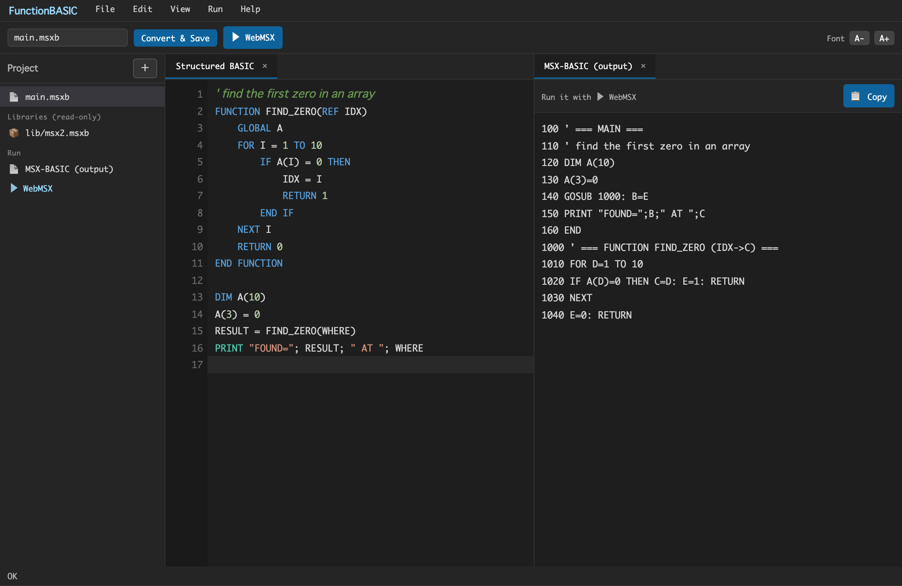
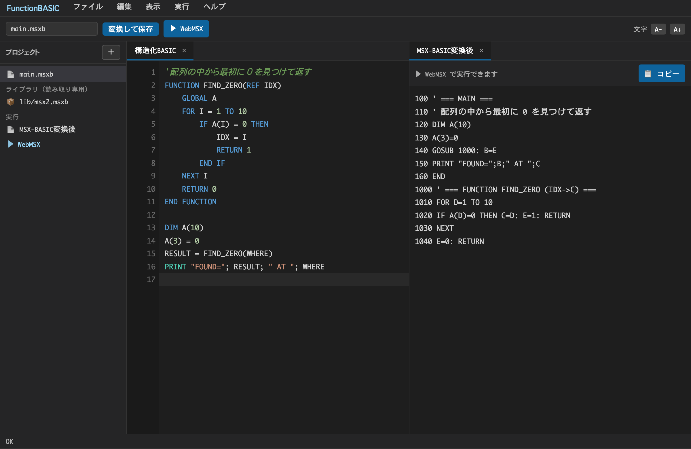
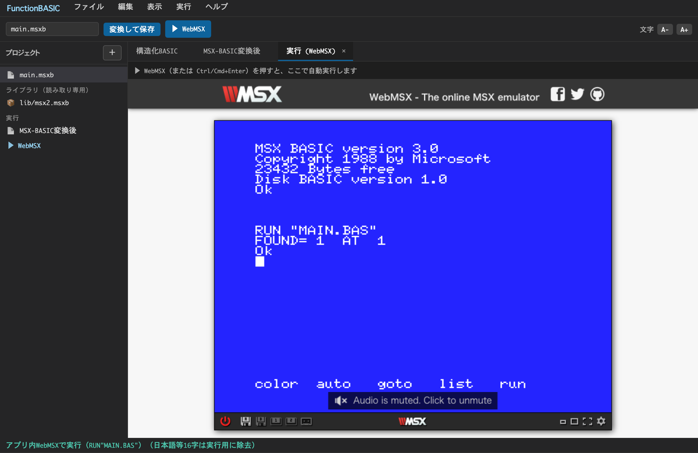

<p align="center">
  
</p>

# FunctionBASIC

### Structured BASIC → MSX-BASIC → webMSX

Write modern, block-structured BASIC, transpile it to authentic MSX-BASIC, and run it instantly in webMSX — all inside one editor.

[](#license)
[](#contributing)
[](#roadmap)
[](https://github.com/suzuki-black/FunctionBASIC/actions)
[](#overview)

> ⚠️ **This is an experimental, work-in-progress tool.** The language, the transpiler, and the editor are all evolving. Expect rough edges, breaking changes, and missing features. Feedback and contributions are very welcome.




---

## Download

Prebuilt desktop app: **[Releases](https://github.com/suzuki-black/FunctionBASIC/releases/latest)** — **macOS** (Apple Silicon): `.dmg` (drag to Applications) or `.zip` (unzip the `.app`); **Windows** (x64): `.msi` or `.exe` installer.

> ⚠️ **Prebuilt for macOS (Apple Silicon / arm64) and Windows (x64).** Other targets (macOS Intel, Linux) → [build from source](#building-from-source). The apps are **not code-signed/notarized**, so the first launch is blocked: on **macOS**, right-click the app → Open → Open (once), or run `xattr -dr com.apple.quarantine /Applications/FunctionBASIC.app`; on **Windows**, SmartScreen may warn — click **More info → Run anyway**. You can also just run the browser editor (`npm run serve`).

---

## Overview

**FunctionBASIC** is a small editor and transpiler that lets you write **Structured BASIC** — a modern dialect with real functions, block structures, local variables, and reference parameters — and converts it into **classic MSX-BASIC** (line numbers, `GOSUB`/`GOTO`, two-letter variables). You can then run the result instantly in **webMSX** without leaving the editor.

**What is Structured BASIC?** It is BASIC the way you would write it today: named `FUNCTION`s instead of `GOSUB` line jumps, `IF / ELSE / END IF` and `FOR / NEXT` blocks you can freely nest, locals by default, `GLOBAL` to opt in to shared state, and `REF` parameters for true pass-by-reference. No line numbers, no manual variable juggling.

**Why convert to MSX-BASIC?** Real MSX machines (and emulators) run tokenized MSX-BASIC. By transpiling, you keep the comfort of structured code while producing programs that run on actual 8-bit hardware and emulators — line-numbered, two-letter-variable, `GOSUB`-based BASIC that an MSX understands natively.

**It also goes the other way.** FunctionBASIC can *decompile* plain, line-numbered MSX-BASIC back into Structured BASIC — no map required. Drop in an old type-in listing and get nested blocks, named `FUNCTION`s, recovered loops, and inferred variable names. The result re-transpiles cleanly for the large majority of real-world programs (see the import/decompiler feature below).

**Why webMSX?** webMSX is an excellent browser MSX emulator. FunctionBASIC embeds it (via an iframe, as an external service) and feeds your converted program straight in, so the loop of *write → convert → run* takes a single click. No floppy juggling, no manual `RUN`.

**Why it pairs well with AI (Claude).** Structured BASIC reads like ordinary structured code, which is exactly what large language models such as Claude generate well — far more reliably than hand-numbered spaghetti BASIC. You can ask an AI for a function, paste it in, convert, and run. This project itself was built iteratively with Claude.

---

## Features

**Language**
- **Structured BASIC** — `FUNCTION`, freely nestable `IF/FOR/WHILE`, local-by-default variables, `GLOBAL`, `REF` parameters, `BREAK`/`CONTINUE`, `RETURN`, arrays (incl. by reference), and `CONST` named constants (folded & inlined at compile time).
- **Recursion** — self- and mutually-recursive functions work, via automatic frame save/restore on a software stack (depth configurable; `REF` params in a recursive function are reported, not mis-compiled).
- **Long, readable names** — write `PLAYER_SCORE` / `ENEMY_X`; the transpiler maps each to a unique 2-character MSX name (MSX only distinguishes the first two characters).

**Transpile to MSX-BASIC**
- **Automatic conversion** — line numbering, 2-char variable allocation, `FUNCTION`→`GOSUB`, return-value handling, and 255-byte line auto-splitting.
- **Multi-file projects** — split code with `INCLUDE`; the build/run uses a single **entry (main) file**, auto-detected (the file with top-level code that nothing else `INCLUDE`s) or pinned explicitly in the project tree. Library files (functions only) are never run standalone. MSX-BASIC has no linker, so everything merges into one program — matching the classic `$INCLUDE`/main-module model.
- **Opt-in optimizations** (Settings → *Transpile*) — constant folding + commutative reassociation (`1+X+2`→`X+3`), power strength reduction (`X^2`→`X*X`), and jump-safe comment stripping. Off by default and guarded so runtime results never change.
- **Safe diagnostics** — never silently mis-converts; errors carry codes and line/column and show as gutter markers. Output is Shift-JIS (unrepresentable characters are reported, not corrupted).
- **Target machines** — MSX1 / MSX2 / MSX2+ / turbo R (default turbo R); the built-in command table is editable.

**Run & export**
- **Instant run** — one click loads and `RUN`s the program in an embedded webMSX.
- **Real disk export** — generate a 720&nbsp;KB FAT12 `.dsk` image for openMSX or real hardware.
- **MSXPLAYer export (`.sav`)** — write a `.sav` virtual floppy for the official MSX emulator **MSXPLAYer** (the same FAT12 image, repacked). Overwrite-safe — the existing file is auto-backed-up first. It is a data hand-off, not a boot disk: place it on MSXPLAYer's work drive, then `FILES` / `RUN"NAME.BAS"`.

**Reverse tools**
- **Decompiler** — import *any* line-numbered MSX-BASIC and get Structured BASIC back: rebuilt blocks, `GOSUB`→`FUNCTION`, recovered `GOTO` loops, event traps, and inferred variable names. ~95% of a real-world `.bas` corpus re-transpiles cleanly. *File → Import plain MSX-BASIC…*
- **Reverse transpilation** — turn FunctionBASIC's own output back into Structured BASIC via the generated map (restoring the original file split where possible).
- **Machine-code annotation** — disassembles Z80 machine code embedded in `DATA` (the `READ`→`POKE`→`USR` idiom) into mnemonic comments with BIOS calls named; stripped on transpile.

**Editor** — syntax highlighting, live preview, error markers, a project file tree (multi-file, browser-persisted), find / replace / project-wide "Find in Files" (JetBrains keymap, regex), **safe identifier rename** (token-aware — skips strings/comments/keywords; `Shift+F6`), go-to-definition / find-usages, undo/redo, editing aids (auto-indent, bracket/quote close, current-line highlight, line move/duplicate — each toggleable), closable split tabs, a native OS menu, and Japanese / English UI.

---

## Usage

1. **Write Structured BASIC** in the editor (functions, blocks, locals — no line numbers).
2. **Convert** — the "MSX-BASIC (output)" tab shows the generated line-numbered BASIC live as you type; "Convert & Save" writes it to disk as Shift-JIS.
3. **Run** — press **▶ WebMSX** (or Ctrl/Cmd+Enter). The program is packaged and loaded into the embedded webMSX, which boots and runs it automatically. For real hardware or openMSX, use **Save Disk (.dsk)** instead.

### Current limitations of the embedded WebMSX player

The in-app player embeds [webMSX](https://webmsx.org) as a **cross-origin iframe**, which means it can only be driven by rebooting with a data-URL disk each run. This brings a few limitations (transpilation itself is unaffected — the generated MSX-BASIC is correct):

- **No FM (MSX-MUSIC) sound here.** Programs using `CALL MUSIC` / `PLAY #2` transpile correctly and play in MSXPen / openMSX / real hardware, but FM stays silent in the embedded player. Verify FM elsewhere.
- **No MSX-AUDIO.** webMSX does not emulate MSX-AUDIO (Y8950); `CALL AUDIO` etc. need openMSX or real hardware.
- **Reboot per run.** Every run reboots the machine (there is a short lead time and no state is preserved between runs).
- **Machine is webMSX's default.** turbo R–only programs (`_TURBO …`, examples/turbo-r.msxb) need the machine switched to turbo R via the webMSX gear (⚙) menu.
- **Audio needs a click.** Browsers may keep audio suspended until you click the webMSX screen once (Web Audio autoplay policy).

For sound-accurate or stateful testing, **Save Disk (.dsk)** and run in openMSX or on real hardware. (A future same-origin player could remove the reboot-per-run and FM limitations — see `TODO.md`.)

> **Tip — paste into MSXPen.** Use the **📋 Copy** button on the *MSX-BASIC (output)* tab to copy the converted program, then paste it into [MSXPen](https://msxpen.com) and run it there — the same program plays with FM audible. Exactly **why FM stays silent in this app's embedded player is still unclear** (a likely-but-unconfirmed cause is that our per-run reboot auto-runs the program from disk before the FM chip has finished initializing). For now, pasting into MSXPen is a reliable way to hear FM without leaving the browser.

---

## Building from source

**Prerequisites:** [Node.js](https://nodejs.org/) ≥ 22.6 (for the zero-dependency core and the browser editor). For the desktop app you also need the [Rust toolchain](https://www.rust-lang.org/tools/install) and the [Tauri prerequisites](https://v2.tauri.app/start/prerequisites/) for your OS (on macOS, the Xcode Command Line Tools).

The core has **no npm dependencies**, so there is nothing to `npm install`.

- **Run the core tests:** `npm test` — type-stripped TypeScript tests via Node's built-in test runner.
- **Browser editor (no build tools):** `npm run serve`, then open `http://localhost:8123`. This type-strips the core into `editor/core/` and serves the editor.
- **Desktop app (development):** `npm run app:dev` — builds the core and launches the Tauri dev window (Rust + system WebView).
- **Desktop app (release build):** `npm run app:build` — produces a bundled application under `src-tauri/target/release/bundle/` for your platform. On macOS this is `FunctionBASIC.app` (in `bundle/macos/`) and a `FunctionBASIC_<version>_<arch>.dmg` installer (in `bundle/dmg/`).

The desktop scripts use `npx @tauri-apps/cli`, so the Tauri CLI is fetched on demand (still no committed dependencies).

> **macOS — opening an unsigned build.** The app is not yet code-signed/notarized (that needs an Apple Developer ID). The first launch is blocked by Gatekeeper; **right-click the app → Open → Open** (once), or run `xattr -dr com.apple.quarantine FunctionBASIC.app`. The default build is Apple-Silicon (arm64); building an Intel/universal binary needs the extra Rust target.

---

## Syntax Guide

| Construct | Form | Notes |
| --- | --- | --- |
| `FUNCTION` | `FUNCTION NAME(params) … END FUNCTION` | Top-level only. Use `REF` before a parameter for pass-by-reference. |
| `IF / ELSE` | `IF cond THEN … ELSE … END IF` | Block form; freely nestable inside loops and other blocks. |
| `FOR / NEXT` | `FOR I = a TO b [STEP s] … NEXT I` | Standard counted loop. |
| `WHILE` | `WHILE cond … WEND` | Condition loop; `BREAK` / `CONTINUE` supported. |
| `GLOBAL` | `GLOBAL X` | Opt in to a shared (global) variable; otherwise variables are local. |
| `CONST` | `CONST NAME = const-expr` | Compile-time constant; folded and inlined as a literal. Re-assignment is an error. |
| `RETURN` | `RETURN [value]` | Returns from a function, optionally with a value. |
| Arrays | `DIM A(n)` ; pass with `REF A` | Arrays may be passed by reference, including string arrays. |

---

## Transpiler Rules

- **Line numbering** — `MAIN` (your top-level code) starts at 100; each function gets its own 1000-step segment (1000, 2000, …). Comments mark each segment.
- **Variable names (length extension)** — MSX-BASIC keeps only a name's first two characters (`COUNT` and `COUNTER` collide) and rejects `_`. FunctionBASIC lifts that: write long descriptive names and an allocator maps each to a unique 2-char MSX name. Pools are per type (`%`/`!`/`#`/`$`, ~960 names each, reserved words excluded) and non-overlapping locals reuse names; a full pool reports `E_VAR_NAMES_EXHAUSTED`.
- **Function expansion** — every `FUNCTION` becomes a `GOSUB` block; calls become `GOSUB <line>` and the call site reads the result variable afterward.
- **Return values** — a function's return value is assigned to a dedicated internal variable, which the caller copies immediately after the `GOSUB`.
- **Internal variable naming** — locals, loop counters, and return variables are allocated from a fixed two-letter pool so they never collide; recursion is handled by saving/restoring frames on a software stack.
- **Arrays by reference** — passing the same array always reuses one block (zero copy); calling a function with *different* arrays duplicates the block per array (monomorphization), so there is no per-call array copy.

### Not available in Structured BASIC

Because Structured BASIC has **no line numbers** and **renames variables to two-letter names**, some classic MSX-BASIC constructs cannot work. The transpiler reports a clear error instead of silently mis-converting — use the structured equivalent:

| Not usable | Use instead |
| --- | --- |
| `GOTO` / `GOSUB <line>` (raw line jumps) | `FUNCTION`, `IF`/`FOR`/`WHILE`, `BREAK`/`CONTINUE` |
| `ON x GOTO/GOSUB <line numbers>` (`E_ON_LINE_TARGET`) | `ON x GOTO/GOSUB <FUNCTION names>` (handlers must be no-arg) |
| `ON ERROR GOTO <line>` | `ON ERROR GOTO <FUNCTION>`, or `ON ERROR GOTO 0` to disable |
| `RESUME <line>` (`E_RESUME_LINE`) | `RESUME` / `RESUME NEXT` / `RESUME 0` |
| `RESTORE <line>` (`E_RESTORE_LINE`) | bare `RESTORE` (reset to the first `DATA`) |
| `DEFINT` / `DEFSNG` / `DEFDBL` / `DEFSTR` (`E_DEF_UNSUPPORTED`) | name suffixes: `%` int, `!` single, `#` double, `$` string (e.g. `COUNT%`, `LABEL$`) |
| `DEF FN` / `DEF USR` | a `FUNCTION` (and `POKE` the USR vector if you truly need machine code) |
| Direct/editor commands: `RUN` `LIST` `AUTO` `RENUM` `NEW` `CONT` `DELETE` `EDIT` | not program statements — they are interactive only |
| Single-line `IF … THEN <stmt>` (no `END IF`) | a block `IF … THEN` … `END IF` |

(`ON … GOSUB <fn>` handler functions and `ON x GOTO/GOSUB <fn>` targets must take **no parameters** — `E_HANDLER_PARAMS`.)

### Strict mode (optional static typing)

Put `STRICT` at the top of a program to turn on **opt-in static type checking** (Rust-style: no implicit conversions). It is off by default — existing code is unaffected, and MSX's usual implicit numeric conversions still apply in non-strict code.

Under `STRICT`:

- **Every variable, array, parameter and `FOR` variable must carry a type suffix** — `%` integer, `!` single, `#` double, `$` string. Untyped names are an error (`E_STRICT_UNTYPED`).
- **Assignments, function arguments and return values must match the type exactly.** No implicit conversion: `A% = B#`, `A% = 1.5`, and any string/number mix are errors (`E_TYPE_MISMATCH`). Convert explicitly with `CINT` / `CSNG` / `CDBL` / `INT` / `FIX` / `ASC` / `STR$` / `VAL` …
- Numeric literals are flexible (`5` fits `%`/`!`/`#`; `1.5` fits `!`/`#`); operators follow MSX promotion, and the exact-match check fires at the assignment/argument/return boundary.
- Because integer (`%`) math is the fast path on the Z80, STRICT also nudges game logic toward `%`. For trig/graphics, keep coordinates and math in one float type (`!`/`#`) — MSX graphics statements accept floats — or convert at the boundary.

```basic
STRICT
FUNCTION ADD%(A%, B%)
    RETURN A% + B%
END FUNCTION
TOTAL% = 0
FOR I% = 1 TO 10 : TOTAL% = ADD%(TOTAL%, I%) : NEXT I%
AVG! = CSNG(TOTAL%) / 10        ' explicit % -> ! conversion
```

See [`examples/strict-demo.msxb`](examples/strict-demo.msxb).

### Machine-code disassembly (annotation)

Old MSX programs often embed Z80 machine code as `DATA` and `POKE` it into memory before calling it via `USR`. FunctionBASIC can make that readable: **Edit → Disassemble machine-code DATA** detects such blocks (the `READ`→`POKE`→`USR` loader idiom, or a `POKE` to the USR vector at `&HF7F8`–`&HF80B`) and inserts a Z80 disassembly above the loader.

- BIOS addresses are resolved to names (e.g. `CALL CHPUT`); disassembly is **control-flow-aware**, so embedded data is shown as `DB …` instead of being mis-decoded.
- The annotation lines use the **`'@` marker** — a distinct kind of comment (shown in its own colour) that is **stripped when transpiling to MSX-BASIC**. Ordinary `'` comments are kept as before.
- It is read-only/best-effort (computed jumps and self-modifying code can't be followed) and never touches the `DATA` bytes. **Edit → Clear annotations** removes them; re-running is idempotent.

```basic
'@ ── machine code @ &HC000 (11 bytes) ──
'@ C000  3E 2A       LD A,2Ah
'@ C002  CD A2 00    CALL CHPUT
'@ C00A  C9          RET
FOR I = 0 TO 10 : READ V : POKE &HC000 + I, V : NEXT
DATA 62, 42, 205, 162, 0, ...
```

---

## Examples

**1. A simple function** — find the first zero in an array.

Structured BASIC:

```basic
' find the first zero in an array
FUNCTION FIND_ZERO(REF IDX)
    GLOBAL A
    FOR I = 1 TO 10
        IF A(I) = 0 THEN
            IDX = I
            RETURN 1
        END IF
    NEXT I
    RETURN 0
END FUNCTION

DIM A(10)
A(3) = 0
RESULT = FIND_ZERO(WHERE)
PRINT "FOUND="; RESULT; " AT "; WHERE
```

Generated MSX-BASIC:

```basic
100 ' === MAIN ===
110 ' find the first zero in an array
120 DIM A(10)
130 A(3)=0
140 GOSUB 1000: B=E
150 PRINT "FOUND=";B;" AT ";C
160 END
1000 ' === FUNCTION FIND_ZERO (IDX->C) ===
1010 FOR D=1 TO 10
1020 IF A(D)=0 THEN C=D: E=1: RETURN
1030 NEXT
1040 E=0: RETURN
```

**2. Multicolour cat from two overlapping sprites (MSX2)** — MSX hardware sprites are a single colour each, so a classic trick is to stack two sprites at the same position to get more colours. A cat (a white face sprite over an orange body sprite) bounces around the screen on its own. Full, convert-tested source: [`examples/cat-sprite.msxb`](examples/cat-sprite.msxb).

The heart of it — one cat is two sprites drawn at the same spot, then moved:

```basic
' one cat = two sprites at the same spot, in two colours
PUT SPRITE 0, (CATX, CATY), 15, 0  ' front: white face
PUT SPRITE 1, (CATX, CATY), 9, 1   ' behind: orange body
```

…which the transpiler turns into authentic MSX-BASIC (variables allocated, coordinates preserved):

```basic
300 PUT SPRITE 0,(A,B),15,0
310 PUT SPRITE 1,(A,B),9,1
```

**3. Game skeleton** — a minimal main loop (illustrative).

Structured BASIC:

```basic
FUNCTION UPDATE()
    GLOBAL SCORE
    SCORE = SCORE + 1
    LOCATE 0, 0 : PRINT "SCORE"; SCORE
END FUNCTION

SCREEN 1
SCORE = 0
WHILE 1
    UPDATE()
    IF STRIG(0) THEN BREAK
WEND
PRINT "GAME OVER"
```

**More** — a full MSX2 `SCREEN 5` graphics + BGM/SE demo (custom palette, `LINE …,BF` / `CIRCLE` / `PAINT`, `SET PAGE` double-buffering, `COPY … TO …`, `PLAY`, `SOUND` — all MSX2 forms preserved verbatim) lives in [`examples/msx2-graphics-sound.msxb`](examples/msx2-graphics-sound.msxb), and a recursion showcase (factorial / Fibonacci / mutual) in [`examples/recursion.msxb`](examples/recursion.msxb). Browse [`examples/`](examples/) and the per-feature [`examples/cookbook/`](examples/cookbook/).

---

## Roadmap

FunctionBASIC is early and developing. **`[x]` = done, `[ ]` = not yet** (no fixed dates):

- [x] **Built-in command coverage by generation** — the MSX / MSX2 / MSX2+ / turbo R command set transpiles correctly: text / printing / file I/O (`PRINT USING`, `LPRINT`, `LINE INPUT`, `OPEN/CLOSE/FIELD … AS`, `GET/PUT #`, `KILL`, `NAME … AS`), type conversion (`CINT`/`CSNG`/`CDBL`, `CVI`/`MKI$` …), file/format functions (`EOF`, `LOC`, `LOF`, `DSKF`, `TAB`, `SPC`, `USR`), the `CALL <name>` / `_<name>` extension mechanism (incl. MSX-MUSIC and MSX-AUDIO), MSX2+ modes (`SCREEN 10`–`12`, `SET SCROLL`), turbo R (`_TURBO ON`/`OFF`, `CALL PCMPLAY`/`PCMREC`/`PAUSE`), and event traps (`ON SPRITE/KEY/INTERVAL … GOSUB <fn>`, `ON ERROR GOTO`, computed `ON <x> GOTO/GOSUB`). A category cookbook in [`examples/cookbook/`](examples/cookbook/) exercises every built-in at least once, checked by `test/cookbook-coverage.test.ts`. See also [`examples/`](examples/).
- [x] **Settings screen (initial version)** — in-app Settings dialog (app menu → Settings…) for language, font size, and the webMSX run machine / `PRESETS` / URL. *Still to do:* editing the built-in command/function table (with reset to defaults) and native-player / emulator paths.
- [x] **MSX2 helper library (initial)** — `INCLUDE "lib/msx2.msxb"` for high-level `M2_*` helpers: SCREEN 5 + 16×16 sprite setup, palette (`M2_PAL`), sprite define/show (`M2_DEFSPR`/`M2_SPR`), **flicker-free double buffering** (`M2_FRAME`/`M2_SHOW`, correct `SET PAGE` order), frame timing (`M2_WAIT`), and a channel-C sound effect (`M2_SE`). Browser-editor `INCLUDE` resolves bundled libraries. See [`examples/lib/msx2.msxb`](examples/lib/msx2.msxb) and [`examples/msx2-lib-demo.msxb`](examples/msx2-lib-demo.msxb). More helpers (graphics primitives, tiles, scrolling) can follow.
- [x] **Modern editor UX** — project file tree (multi-file, browser-persisted), find / replace and project-wide "Find in Files" (JetBrains keymap, regex), undo/redo, editing aids (auto-indent, bracket/quote auto-close, current-line highlight, line duplicate/move), and closable tabs — all in the lightweight zero-dependency editor.
- [x] **Machine-code disassembly annotation** — detect machine code embedded in `DATA` and annotate it with Z80 mnemonics (BIOS names resolved, control-flow-aware code/data separation) using the `'@` comment marker, stripped on transpile. (Edit → Disassemble machine-code DATA.)
- [x] **Plain MSX-BASIC import (decompiler)** — map-free reverse from any line-numbered MSX-BASIC: structure recovery (`FOR`/`WHILE`/`IF`, `GOSUB`→`FUNCTION`, `GOTO`→loops, `DEF FN`, event traps) + variable-name inference, best-effort with warnings. Round-trip harness (`scripts/eval-reverse.ts`) measures accuracy on a real-world corpus (kept local / not committed): **~95% of real `.bas` listings re-transpile cleanly (essentially all within MSX-BASIC scope)**. Wired into the editor (*File → Import plain MSX-BASIC…*). The residual gaps are non-MSX dialects (`PRINT @`, `THEN`-less `IF`) and corrupted/binary listings.
- [x] **MSXPLAYer `.sav` export** — write a `.sav` virtual floppy for the official MSX emulator (MSXPLAYer) by repacking the `.dsk` FAT12 image (all 1440 sectors); overwrite-safe (the existing file is auto-backed-up first). A data hand-off — place it on the work drive, then `FILES` / `RUN` — not a boot disk. (*File → Save for MSXPLAYer (.sav)…*) Format per SAVList / MakeBlankSav (MIT).
- [ ] **Sound helpers** — BGM/SE helper layer (PSG, and where available FM/SCC). (`PLAY` statement+function and `SOUND` already transpile.)
- [ ] **Native MSX playback (auto-launch)** — beyond the embedded webMSX and the `.sav` hand-off above: launch openMSX with the generated `.dsk` auto-mounted and `RUN` it via a Tcl script, and/or auto-launch MSXPLAYer. (Would also make FM/MSX-AUDIO audible — see the FM limitation under *Usage*.)
- [ ] **Editor — code folding & large-file performance** — likely a CodeMirror-based editor, beyond today's lightweight zero-dependency one.
- [ ] **Language growth** — richer Structured BASIC: `SELECT/CASE`, more string helpers, local arrays, ergonomic improvements. *(`CONST` named constants done.)*
- [x] **Windows support (build & test)** — the Tauri desktop app builds and runs on Windows (x64); `.msi` and `.exe` installers are published in [Releases](https://github.com/suzuki-black/FunctionBASIC/releases/latest). ⚠️ **Not code-signed yet** — Windows SmartScreen warns on first run (*More info → Run anyway*). Code-signing and CI packaging are still to do.
- [ ] **AI integration** — tighter "describe it, generate it, convert it, run it" flow with Claude.
- [ ] **Tooling / CI** — expand GitHub Actions (core tests already run) to full desktop (Tauri) builds, signed / notarized binaries, and release packaging.

Tracked work and ideas live in the issue tracker. Suggestions are welcome.

---

## Contributing

Contributions are welcome.

- **Issues** — bug reports, feature requests, and design discussion. Please include steps to reproduce and your platform.
- **Pull requests** — small, focused PRs are easiest to review. Run the existing tests before submitting, and describe what changed and why.

---

## License

Released under the **MIT License**.

MIT © 2026 suzuki-black

You may use, copy, modify, and distribute this software freely, including for commercial purposes, provided the copyright notice and permission notice are kept. The software is provided "as is", without warranty of any kind. See the `LICENSE` file for the full text.

---

## Trademark & External Service Notice

- **MSX** is a trademark of its respective rights holder. This project is **unofficial** and is not affiliated with, endorsed by, or sponsored by the MSX trademark holder.
- **webMSX** is an **external service / third-party emulator**. FunctionBASIC merely links to and embeds it via an iframe; it does not bundle or redistribute webMSX, and it is **not an official webMSX product**.
- We use these technologies with **gratitude and respect** for the MSX trademark holder and for the author of webMSX, whose work makes projects like this possible.

---
---

# FunctionBASIC（日本語）

### 構造化BASIC → MSX-BASIC → webMSX

モダンなブロック構造の構造化BASICを書き、本物のMSX-BASICへ変換し、そのまま webMSX で即実行 — すべて1つのエディタの中で。

> ⚠️ **これは実験的かつ発展途上のツールです。** 言語・変換器・エディタはいずれも進化の途中で、粗削りな部分・破壊的変更・未実装機能があります。フィードバックと貢献を歓迎します。





---

## ダウンロード

ビルド済みデスクトップ版：**[Releases](https://github.com/suzuki-black/FunctionBASIC/releases/latest)** — **macOS**（Apple Silicon）：`.dmg`（Applicationsへドラッグ）/ `.zip`（`.app` を展開）、**Windows**（x64）：`.msi` または `.exe` インストーラ。

> ⚠️ **配布物は macOS（Apple Silicon / arm64）と Windows（x64）。** それ以外（macOS Intel・Linux 等）は[ソースからビルド](#ソースからのビルド)。**コード署名/公証していない**ため初回起動は止められます — **macOS** はアプリを右クリック → 開く → 開く（初回のみ）、または `xattr -dr com.apple.quarantine /Applications/FunctionBASIC.app`。**Windows** は SmartScreen が警告したら **詳細情報 → 実行** をクリック。ブラウザ版（`npm run serve`）だけでも使えます。

---

## 概要

**FunctionBASIC** は、**構造化BASIC**（本物の関数・ブロック構造・ローカル変数・参照引数を備えたモダンな方言）を書き、それを**昔ながらのMSX-BASIC**（行番号・`GOSUB`/`GOTO`・2文字変数）へ変換する小さなエディタ兼トランスパイラです。変換結果はエディタから離れることなく **webMSX** で即実行できます。

**構造化BASICとは？** いまの感覚で書けるBASICです。`GOSUB` の行ジャンプではなく名前付き `FUNCTION`、自由に入れ子にできる `IF / ELSE / END IF` や `FOR / NEXT`、既定でローカルな変数、共有したいときだけ使う `GLOBAL`、そして真の参照渡しを行う `REF` 引数。行番号も手作業の変数管理も不要です。

**なぜMSX-BASICへ変換するのか？** 実機のMSX（やエミュレータ）はトークン化されたMSX-BASICで動きます。変換することで、構造化された書き味のまま、8bit実機やエミュレータで動く——行番号・2文字変数・`GOSUB`ベースの——MSXが直接理解できるプログラムを得られます。

**逆方向にも変換できます。** FunctionBASIC は素の行番号付きMSX-BASICを構造化BASICへ*逆変換（デコンパイル）*できます——マップ不要。昔の打ち込みリストを入れると、入れ子ブロック・名前付き `FUNCTION`・復元されたループ・推測された変数名が得られます。出力は実在プログラムの大多数でそのまま再トランスパイル可能です（下の取込/デコンパイラ項目を参照）。

**なぜwebMSXか？** webMSX は優れたブラウザ向けMSXエミュレータです。FunctionBASIC は（外部サービスとして iframe 経由で）これを埋め込み、変換結果を直接流し込むので、*書く→変換→実行* のループがワンクリックになります。ディスクの差し替えも手動 `RUN` も不要です。

**AI（Claude）との相性。** 構造化BASICは普通の構造化コードのように読めます。これはまさに Claude のような大規模言語モデルが得意とする形で、手作業で行番号を振ったスパゲッティBASICより遥かに安定して生成できます。関数をAIに頼んで貼り付け、変換して実行——本プロジェクト自体も Claude と反復的に作られました。

---

## 特徴

**言語**
- **構造化BASIC** — `FUNCTION`、自由に入れ子可能な `IF/FOR/WHILE`、既定ローカル変数、`GLOBAL`、`REF` 参照引数、`BREAK`/`CONTINUE`、`RETURN`、配列（参照渡し含む）、`CONST` 名前付き定数（コンパイル時に畳み込み＆インライン）。
- **再帰** — 自己・相互再帰の関数が動く。再帰 `GOSUB` の前後でフレームをソフトウェアスタックへ自動退避／復元（深さ可変。再帰関数内の `REF` 引数は誤変換せずエラー報告）。
- **長く読みやすい変数名** — `PLAYER_SCORE` / `ENEMY_X` のような説明的な名前を書け、変換器が一意な2文字MSX名へ自動割り当て（MSXは先頭2文字しか区別しない）。

**MSX-BASICへの変換**
- **自動変換** — 行番号付与、2文字変数の割り当て、`FUNCTION`→`GOSUB` 展開、戻り値処理、255バイト行の自動分割。
- **複数ファイル対応** — `INCLUDE` でコードを分割。ビルド/実行は単一の**エントリ（main）ファイル**を起点にする。自動判定（トップレベルに実行コードがあり、他からINCLUDEされていないファイル）か、プロジェクトツリーで明示指定。関数だけのライブラリファイルは単体実行されない。MSX-BASICにリンカは無いので全て1本のプログラムへ統合される（古典の `$INCLUDE`/メインモジュール方式と同じ）。
- **オプトイン最適化**（設定→*変換*） — 定数畳み込み＋可換再結合（`1+X+2`→`X+3`）、べき乗の強度低減（`X^2`→`X*X`）、飛び先安全なコメント除去。いずれも既定OFFで、実行結果を変えないようガード。
- **安全な診断** — 黙って誤変換しない。エラーはコード＋行・列付きでガターに表示。出力は Shift-JIS（表現不能文字は壊さず報告）。
- **対象機種** — MSX1 / MSX2 / MSX2+ / turboR（既定 turboR）。組み込み命令表は編集可能。

**実行・書き出し**
- **即時実行** — 埋め込み webMSX に流し込み、自動でロード＆`RUN`。ワンクリック。
- **実ディスク書き出し** — openMSX・実機用に 720&nbsp;KB FAT12 の `.dsk` を生成。
- **MSXPLAYer書き出し（`.sav`）** — 公式MSXエミュレータ **MSXPLAYer** 用の `.sav` 仮想フロッピーを生成（中身は同じ FAT12 イメージの詰め替え）。**上書き前に既存ファイルを自動バックアップ**。起動ディスクではなくデータ受け渡し用途で、MSXPLAYer のワークドライブに置いて `FILES` / `RUN"NAME.BAS"`。

**逆方向ツール**
- **デコンパイラ** — *任意の*行番号付きMSX-BASICを構造化BASICへ逆変換：ブロック再構築、`GOSUB`→`FUNCTION`、`GOTO`ループ復元、イベントトラップ、変数名推測。実コーパスの約95%がエラーなく再変換可能。*ファイル → 素のMSX-BASICを取込…*
- **逆変換** — FunctionBASIC 自身の出力を、生成マップで構造化BASICへ戻す（元のファイル分割も可能な範囲で復元）。
- **機械語の逆アセンブル注釈** — `DATA` に埋め込まれた機械語（`READ`→`POKE`→`USR`）を Z80 ニーモニックの注釈に（BIOS呼び出しは名前解決）。変換時に削除。

**エディタ** — シンタックスハイライト、ライブプレビュー、エラー表示、プロジェクトツリー（複数ファイル・ブラウザ永続）、検索・置換・全体検索（JetBrains風キーマップ・正規表現）、**識別子の安全な一括リネーム**（字句解析ベース＝文字列/コメント/キーワードは触らない・`Shift+F6`）、定義へ移動/使用箇所、元に戻す/やり直し、編集支援（自動インデント・括弧/引用符補完・現在行ハイライト・行移動/複製。各々ON/OFF）、閉じられる分割タブ、OSネイティブメニュー、日本語/英語UI。

---

## 使い方

1. **構造化BASICを書く**（関数・ブロック・ローカル変数。行番号は不要）。
2. **変換** — 「MSX-BASIC変換後」タブに、入力に追従して行番号付きBASICがライブ表示されます。「変換して保存」で Shift-JIS として書き出します。
3. **実行** — **▶ WebMSX**（または Ctrl/Cmd+Enter）。プログラムが梱包されて埋め込み webMSX に読み込まれ、自動で起動・実行します。実機や openMSX 向けには **ディスク(.dsk)を保存** を使います。

### 埋め込み WebMSX 実行の現状の制限

アプリ内プレイヤーは [webMSX](https://webmsx.org) を**別オリジンの iframe** として埋め込んでいるため、実行のたびに data-URL ディスクで**リブートする**方式に限られます。これにより以下の制限があります（**変換自体には影響なし**＝生成される MSX-BASIC は正しい）：

- **FM（MSX-MUSIC）音は鳴りません。** `CALL MUSIC` / `PLAY #2` を使うプログラムは正しく変換され、MSXPen・openMSX・実機では鳴りますが、埋め込みプレイヤーでは無音です。FM は他環境で確認してください。
- **MSX-AUDIO 非対応。** webMSX は MSX-AUDIO（Y8950）をエミュレートしません。`CALL AUDIO` 等は openMSX か実機が必要です。
- **実行ごとにリブート。** 毎回マシンが再起動します（短いリードタイムがあり、実行間で状態は保持されません）。
- **マシンは webMSX 既定。** turbo R 専用プログラム（`_TURBO …`、examples/turbo-r.msxb）は、webMSX の歯車（⚙）メニューでマシンを turbo R に切り替えてください。
- **音はクリックで開始。** ブラウザの自動再生制限により、webMSX 画面を一度クリックするまで音が止まることがあります。

音まで正確に、あるいは状態を保って試すには、**ディスク(.dsk)を保存** して openMSX か実機で実行してください。（将来の同一オリジン版プレイヤーで、リブート毎回と FM の制限は解消し得ます — `TODO.md` 参照。）

> **ヒント — MSXPen に貼り付け。** *MSX-BASIC変換後* タブの **📋 コピー** ボタンで変換後プログラムをコピーし、[MSXPen](https://msxpen.com) に貼り付けて実行すると、同じプログラムが FM 付きで鳴ります。本アプリの埋め込みプレイヤーで **FM が鳴らない理由は現状不明**です（実行のたびにリブートしてディスクから自動実行するため、FM 音源チップの初期化前に走っている可能性がありますが未確認）。当面は MSXPen に貼り付けるのが確実に FM を聴ける方法です。

---

## ソースからのビルド

**前提:** [Node.js](https://nodejs.org/) 22.6 以上（依存ゼロのコア＆ブラウザ版エディタ用）。デスクトップ版にはさらに [Rust ツールチェイン](https://www.rust-lang.org/tools/install) と、OSごとの [Tauri 前提条件](https://v2.tauri.app/start/prerequisites/)（macOS なら Xcode Command Line Tools）が必要です。

コアは **npm依存ゼロ**なので `npm install` は不要です。

- **コアのテスト:** `npm test` — Node 標準テストランナーで型ストリップした TypeScript を実行。
- **ブラウザ版エディタ（ビルドツール不要）:** `npm run serve` 後、`http://localhost:8123` を開く。コアを `editor/core/` へ型ストリップしてエディタを配信します。
- **デスクトップ版（開発）:** `npm run app:dev` — コアをビルドし Tauri 開発ウィンドウ（Rust＋システムWebView）を起動。
- **デスクトップ版（リリースビルド）:** `npm run app:build` — `src-tauri/target/release/bundle/` にOS向けのアプリを生成。macOSでは `FunctionBASIC.app`（`bundle/macos/`）と `FunctionBASIC_<バージョン>_<アーキ>.dmg` インストーラ（`bundle/dmg/`）。

デスクトップ用スクリプトは `npx @tauri-apps/cli` を使うため、Tauri CLI は必要時に取得されます（コミット対象の依存は増えません）。

> **macOS — 未署名ビルドの開き方。** まだコード署名/公証していません（Apple Developer ID が必要）。初回は Gatekeeper に止められるので、**アプリを右クリック → 開く → 開く**（初回のみ）、または `xattr -dr com.apple.quarantine FunctionBASIC.app`。既定ビルドは Apple Silicon（arm64）。Intel/ユニバーサルにするには追加の Rust ターゲットが必要。

---

## 文法ガイド

| 構文 | 形 | 補足 |
| --- | --- | --- |
| `FUNCTION` | `FUNCTION 名前(引数) … END FUNCTION` | トップレベルのみ。参照渡しは引数の前に `REF`。 |
| `IF / ELSE` | `IF 条件 THEN … ELSE … END IF` | ブロック形式。ループ等の中に自由に入れ子可。 |
| `FOR / NEXT` | `FOR I = a TO b [STEP s] … NEXT I` | 標準の数え上げループ。 |
| `WHILE` | `WHILE 条件 … WEND` | 条件ループ。`BREAK` / `CONTINUE` 対応。 |
| `GLOBAL` | `GLOBAL X` | 共有（グローバル）変数を使う宣言。なければローカル。 |
| `CONST` | `CONST 名前 = 定数式` | コンパイル時定数。畳み込んでリテラルとしてインライン。再代入はエラー。 |
| `RETURN` | `RETURN [値]` | 関数から戻る。値を返せる。 |
| 配列 | `DIM A(n)` ／ `REF A` で渡す | 配列は参照渡し可。文字列配列も可。 |

---

## 変換ルール

- **行番号の付与** — `MAIN`（トップレベルのコード）は 100 から。各関数は 1000 刻みの専用セグメント（1000, 2000, …）。各セグメントはコメントで明示。
- **変数名の変換（長さ拡張）** — MSXは名前の**先頭2文字しか区別せず**（`COUNT` と `COUNTER` は衝突）、`_` も不可。FunctionBASICはこれを撤廃し、長い説明的な名前を書くと各変数へ**一意な2文字MSX名**を自動割り当て。プールは型別（`%`/`!`/`#`/`$` 各約960個・予約語除外）で、生存区間が重ならないローカルは名前を再利用。使い切ると `E_VAR_NAMES_EXHAUSTED`。
- **関数の展開（GOSUB化）** — すべての `FUNCTION` は `GOSUB` ブロックに。呼び出しは `GOSUB <行>` になり、直後に結果変数を読み取ります。
- **戻り値の扱い** — 戻り値は専用の内部変数へ代入し、呼び出し側が `GOSUB` 直後にコピーします。
- **内部変数の命名規則** — ローカル・ループ変数・戻り値変数は固定の2文字プールから割り当て、衝突しません。再帰はソフトウェアスタックでフレームを退避して対応します。
- **配列の参照渡し** — 常に同じ配列ならブロック1個を共有（ゼロコピー）。異なる配列で呼ぶと配列ごとにブロックを複製（モノモーフィック化）し、呼び出しごとの配列コピーは発生しません。

### 構造化BASICで使えない命令

構造化BASICは**行番号が無く**、**変数を2文字名に改名**するため、一部の旧来MSX-BASIC構文は動作しません。トランスパイラは**黙って誤変換せずエラー**で知らせます。下表の構造化での代替を使ってください：

| 使えない | 代わりに |
| --- | --- |
| `GOTO` / `GOSUB <行番号>`（行ジャンプ） | `FUNCTION`・`IF`/`FOR`/`WHILE`・`BREAK`/`CONTINUE` |
| `ON x GOTO/GOSUB <行番号>`（`E_ON_LINE_TARGET`） | `ON x GOTO/GOSUB <関数名>`（ハンドラは無引数） |
| `ON ERROR GOTO <行番号>` | `ON ERROR GOTO <関数>`、無効化は `ON ERROR GOTO 0` |
| `RESUME <行番号>`（`E_RESUME_LINE`） | `RESUME` / `RESUME NEXT` / `RESUME 0` |
| `RESTORE <行番号>`（`E_RESTORE_LINE`） | 引数なし `RESTORE`（先頭の `DATA` へ） |
| `DEFINT`/`DEFSNG`/`DEFDBL`/`DEFSTR`（`E_DEF_UNSUPPORTED`） | 名前サフィックス：`%`整数 `!`単精度 `#`倍精度 `$`文字列（例 `COUNT%`・`LABEL$`） |
| `DEF FN` / `DEF USR` | `FUNCTION`（機械語が要るなら USR ベクタを `POKE`） |
| 直接モード命令：`RUN` `LIST` `AUTO` `RENUM` `NEW` `CONT` `DELETE` `EDIT` | プログラム文ではない（対話専用） |
| 1行 `IF … THEN <文>`（`END IF` 無し） | ブロックの `IF … THEN` … `END IF` |

（`ON … GOSUB <関数>` のハンドラや `ON x GOTO/GOSUB <関数>` の飛び先関数は**無引数**でなければなりません — `E_HANDLER_PARAMS`。）

### 厳格モード（任意の静的型付け）

プログラム先頭に `STRICT` と書くと、**オプトインの静的型チェック**（rust方式＝暗黙変換なし）が有効になります。既定はオフで、既存コードに影響はありません（非strictでは従来どおりMSXの暗黙数値変換のまま）。

`STRICT` では：

- **全ての変数・配列・引数・`FOR`変数に型サフィックス必須** — `%`整数 `!`単精度 `#`倍精度 `$`文字列。無いとエラー（`E_STRICT_UNTYPED`）。
- **代入・引数・戻り値は型が完全一致**。暗黙変換なし：`A% = B#`・`A% = 1.5`・文字列/数値の混在はエラー（`E_TYPE_MISMATCH`）。変換は `CINT` / `CSNG` / `CDBL` / `INT` / `FIX` / `ASC` / `STR$` / `VAL` … で明示。
- 数値リテラルは柔軟（`5`は%/!/#可、`1.5`は!/#）。演算子はMSXの昇格に従い、完全一致判定は代入/引数/戻り値の境界で行われます。
- Z80では整数(`%`)演算が速いので、STRICTはゲームロジックを`%`へ寄せます。三角関数/グラフィックスは座標も計算も浮動小数(`!`/`#`)で統一（MSXの描画命令は浮動小数を受けます）するか、境界で明示変換を。

```basic
STRICT
FUNCTION ADD%(A%, B%)
    RETURN A% + B%
END FUNCTION
TOTAL% = 0
FOR I% = 1 TO 10 : TOTAL% = ADD%(TOTAL%, I%) : NEXT I%
AVG! = CSNG(TOTAL%) / 10        ' % → ! の明示変換
```

例：[`examples/strict-demo.msxb`](examples/strict-demo.msxb)。

### 機械語の逆アセンブル注釈

昔のMSXプログラムは、Z80機械語を `DATA` に埋め込み `POKE` で配置してから `USR` で呼ぶことがよくあります。FunctionBASIC はそれを読めるようにします：**編集 →「機械語DATAを逆アセンブル注釈」** で、こうしたブロック（`READ`→`POKE`→`USR` ローダ idiom、または USRベクタ `&HF7F8`–`&HF80B` への `POKE`）を検出し、ローダの上に Z80 逆アセンブルを挿入します。

- BIOSアドレスは名前解決（例 `CALL CHPUT`）。逆アセンブルは**制御フロー追跡**で、埋め込みデータは誤デコードせず `DB …` として表示。
- 注釈行は **`'@` マーカー**の専用コメント（別色表示）で、**MSX-BASIC 変換時に削除**されます。通常の `'` コメントは従来どおり残ります。
- 読み取り専用・best-effort（計算ジャンプや自己書き換えは追えません）で `DATA` バイトは一切変更しません。**編集 →「注釈を消す」**で除去でき、再実行しても冪等です。

```basic
'@ ── 機械語 @ &HC000 (11 bytes) ──
'@ C000  3E 2A       LD A,2Ah
'@ C002  CD A2 00    CALL CHPUT
'@ C00A  C9          RET
FOR I = 0 TO 10 : READ V : POKE &HC000 + I, V : NEXT
DATA 62, 42, 205, 162, 0, ...
```

---

## サンプル

**1. 簡単な関数** — 配列の中から最初の 0 を見つける。

構造化BASIC:

```basic
' 配列の中から最初に 0 を見つけて返す
FUNCTION FIND_ZERO(REF IDX)
    GLOBAL A
    FOR I = 1 TO 10
        IF A(I) = 0 THEN
            IDX = I
            RETURN 1
        END IF
    NEXT I
    RETURN 0
END FUNCTION

DIM A(10)
A(3) = 0
RESULT = FIND_ZERO(WHERE)
PRINT "FOUND="; RESULT; " AT "; WHERE
```

変換後 MSX-BASIC:

```basic
100 ' === MAIN ===
110 ' 配列の中から最初に 0 を見つけて返す
120 DIM A(10)
130 A(3)=0
140 GOSUB 1000: B=E
150 PRINT "FOUND=";B;" AT ";C
160 END
1000 ' === FUNCTION FIND_ZERO (IDX->C) ===
1010 FOR D=1 TO 10
1020 IF A(D)=0 THEN C=D: E=1: RETURN
1030 NEXT
1040 E=0: RETURN
```

**2. 2枚重ねスプライトの多色猫（MSX2）** — MSXのハードウェアスプライトは1枚＝1色なので、同じ位置に2枚重ねて多色にするのが定番技です。白い顔スプライトをオレンジの体スプライトに重ねた猫が、画面内を自分で跳ね回ります。変換確認済みの全ソース：[`examples/cat-sprite.msxb`](examples/cat-sprite.msxb)。

肝は「1匹の猫＝同じ位置に2枚のスプライト」を描いて動かすこと：

```basic
' 1匹の猫＝同じ位置に2枚のスプライト（2色）
PUT SPRITE 0, (CATX, CATY), 15, 0  ' 前面：白い顔
PUT SPRITE 1, (CATX, CATY), 9, 1   ' 背面：オレンジの体
```

…これを変換器が本物のMSX-BASICにします（変数割当・座標は保持）：

```basic
300 PUT SPRITE 0,(A,B),15,0
310 PUT SPRITE 1,(A,B),9,1
```

**3. ゲームの雛形** — 最小のメインループ（説明用）。

構造化BASIC:

```basic
FUNCTION UPDATE()
    GLOBAL SCORE
    SCORE = SCORE + 1
    LOCATE 0, 0 : PRINT "SCORE"; SCORE
END FUNCTION

SCREEN 1
SCORE = 0
WHILE 1
    UPDATE()
    IF STRIG(0) THEN BREAK
WEND
PRINT "GAME OVER"
```

**その他** — MSX2 `SCREEN 5` のグラフィック＋BGM/SEデモ（独自パレット、`LINE …,BF` / `CIRCLE` / `PAINT`、`SET PAGE` ダブルバッファ、`COPY … TO …`、`PLAY`、`SOUND` などMSX2固有書式をそのまま保持）は [`examples/msx2-graphics-sound.msxb`](examples/msx2-graphics-sound.msxb)、再帰のショーケース（階乗／フィボナッチ／相互再帰）は [`examples/recursion.msxb`](examples/recursion.msxb)。[`examples/`](examples/) と機能別の [`examples/cookbook/`](examples/cookbook/) もどうぞ。

---

## ロードマップ

FunctionBASIC はまだ初期段階で、発展途上です。**`[x]`＝対応済 / `[ ]`＝未対応**（時期は未定）：

- [x] **世代別の組み込み命令網羅** — MSX / MSX2 / MSX2+ / turbo R の命令一式が正しく変換されます：テキスト/印字/ファイル入出力（`PRINT USING`・`LPRINT`・`LINE INPUT`・`OPEN/CLOSE/FIELD … AS`・`GET/PUT #`・`KILL`・`NAME … AS`）、型変換（`CINT`/`CSNG`/`CDBL`、`CVI`/`MKI$` 等）、ファイル/書式関数（`EOF`・`LOC`・`LOF`・`DSKF`・`TAB`・`SPC`・`USR`）、`CALL <名>`/`_<名>` 拡張機構（MSX-MUSIC・MSX-AUDIO 含む）、MSX2+（`SCREEN 10`–`12`・`SET SCROLL`）、turbo R（`_TURBO ON`/`OFF`・`CALL PCMPLAY`/`PCMREC`/`PAUSE`）、イベントトラップ（`ON SPRITE/KEY/INTERVAL … GOSUB <fn>`・`ON ERROR GOTO`・計算分岐 `ON <x> GOTO/GOSUB`）。各カテゴリの全組み込みを1回ずつ使う網羅サンプルが [`examples/cookbook/`](examples/cookbook/)（`test/cookbook-coverage.test.ts` で網羅を自動検証）。例：[`examples/`](examples/)。
- [x] **設定画面（初版）** — アプリ内設定ダイアログ（アプリメニュー →「設定…」）で、言語・フォントサイズ・WebMSX 実行機種／`PRESETS`／URL を変更可能。*今後：*組み込み命令・関数表の編集（既定へのリセット付き）とネイティブプレイヤー／エミュレータのパス。
- [x] **MSX2 ヘルパライブラリ（初版）** — `INCLUDE "lib/msx2.msxb"` で高レベルな `M2_*` 関数：SCREEN 5＋16×16スプライト初期化、パレット（`M2_PAL`）、スプライト定義/表示（`M2_DEFSPR`/`M2_SPR`）、**ちらつかないダブルバッファ**（`M2_FRAME`/`M2_SHOW`、`SET PAGE` の正しい順）、フレーム待ち（`M2_WAIT`）、空きチャンネルCのSE（`M2_SE`）。ブラウザ版エディタでも組み込みライブラリの `INCLUDE` を解決します。例：[`examples/lib/msx2.msxb`](examples/lib/msx2.msxb)・[`examples/msx2-lib-demo.msxb`](examples/msx2-lib-demo.msxb)。今後：図形プリミティブ・タイル・スクロール等を追加予定。
- [x] **モダンなエディタ体験** — プロジェクトツリー（複数ファイル・ブラウザ永続）、検索/置換と全体検索（Find in Files、JetBrains風キーマップ・正規表現）、元に戻す/やり直し、編集支援（自動インデント・括弧/引用符補完・現在行ハイライト・行複製/移動）、閉じられるタブ。軽量・依存ゼロのまま実現。
- [x] **機械語の逆アセンブル注釈** — `DATA` に埋め込まれた機械語を検出し、Z80 ニーモニックで注釈（BIOS名解決・制御フロー追跡でコード/データ分離）。`'@` マーカーのコメントで、変換時に削除。（編集 →「機械語DATAを逆アセンブル注釈」）
- [x] **素のMSX-BASIC取込（デコンパイラ）** — マップ不要で任意の行番号付きMSX-BASICを逆変換：構造復元（`FOR`/`WHILE`/`IF`・`GOSUB`→`FUNCTION`・`GOTO`→ループ・`DEF FN`・イベントトラップ）＋変数名推測、best-effort（還元不能は警告）。ラウンドトリップ評価（`scripts/eval-reverse.ts`）で実コーパス（ローカル限定・非コミット）に対し精度計測：**実 `.bas` の約95%（MSX-BASIC範囲ではほぼ全て）がエラーなく再トランスパイル可能**。エディタに統合済み（*ファイル → 素のMSX-BASICを取込…*）。残る穴は非MSX方言（`PRINT @`・`THEN` 無し `IF`）か破損/バイナリ listing。
- [x] **MSXPLAYer `.sav` 書き出し** — 公式MSXエミュレータ（MSXPLAYer）用の `.sav` 仮想フロッピーを、`.dsk` の FAT12 イメージ（全1440セクタ）を詰め替えて生成。**上書き前に既存ファイルを自動バックアップ**。起動ディスクではなくデータ受け渡し（ワークドライブに置いて `FILES` / `RUN`）。（*ファイル → MSXPLAYer用(.sav)を保存…*）形式は SAVList / MakeBlankSav（MIT）準拠。
- [ ] **サウンドのヘルパ** — BGM/SE ヘルパ層（PSG、可能なら FM/SCC）。（文・関数の `PLAY` と `SOUND` は変換済み）
- [ ] **ネイティブMSXプレイヤー対応（自動起動）** — 埋め込み webMSX と上記 `.sav` 受け渡しに加え、生成した `.dsk` を openMSX に自動マウントして Tcl で `RUN`、および/または MSXPLAYer の自動起動。（FM/MSX-AUDIO を実音で鳴らせるようになる ―《使い方》の FM 制限を参照）
- [ ] **エディタ：コード折りたたみ・大規模ファイル性能** — CodeMirror ベース想定。現状の軽量・依存ゼロエディタを発展。
- [ ] **言語の拡張** — より豊かな構造化BASIC：`SELECT/CASE`、文字列ヘルパ、ローカル配列、使い勝手。*（`CONST` 名前付き定数は対応済み。）*
- [x] **Windows対応（ビルド・動作確認）** — Tauri デスクトップ版が Windows（x64）でビルド・起動でき、`.msi`/`.exe` を [Releases](https://github.com/suzuki-black/FunctionBASIC/releases/latest) で公開。⚠️ **コード署名は未**（初回起動時に Windows SmartScreen が警告 → 詳細情報→実行）。コード署名と CI パッケージングは今後。
- [ ] **AI生成との統合** — Claude との「説明→生成→変換→実行」をより緊密に。
- [ ] **ツール整備 / CI** — GitHub Actions（コアテストは導入済み）をデスクトップ(Tauri)フルビルド・署名/公証バイナリ・リリースパッケージングへ拡張。

作業項目やアイデアは Issue で管理しています。提案を歓迎します。

---

## 貢献方法

貢献を歓迎します。

- **Issue** — バグ報告・機能要望・設計の議論。再現手順と利用環境を添えてください。
- **Pull Request** — 小さく焦点の絞れたPRがレビューしやすいです。既存テストを実行し、変更内容と理由を記載してください。

---

## ライセンス

**MITライセンス**で公開しています。

MIT © 2026 suzuki-black

著作権表示と許諾表示を保持すれば、商用を含め自由に使用・複製・改変・配布できます。本ソフトウェアは「現状有姿」で提供され、いかなる保証もありません。全文は `LICENSE` ファイルを参照してください。

---

## 商標・外部サービスに関する注意

- **MSX** は各権利者の商標です。本プロジェクトは**非公式**であり、MSX商標権者と提携・承認・後援の関係はありません。
- **webMSX** は**外部サービス／サードパーティのエミュレータ**です。FunctionBASIC は iframe 経由でリンク・埋め込みをしているだけで、webMSX を同梱・再配布しておらず、**公式の webMSX 製品ではありません**。
- これらの技術を、MSX商標権者および webMSX 作者への**感謝と敬意**をもって利用しています。彼らの仕事が、このようなプロジェクトを可能にしています。
